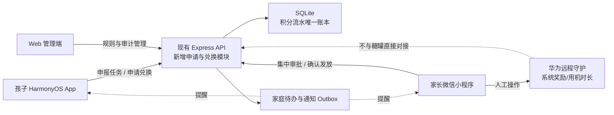
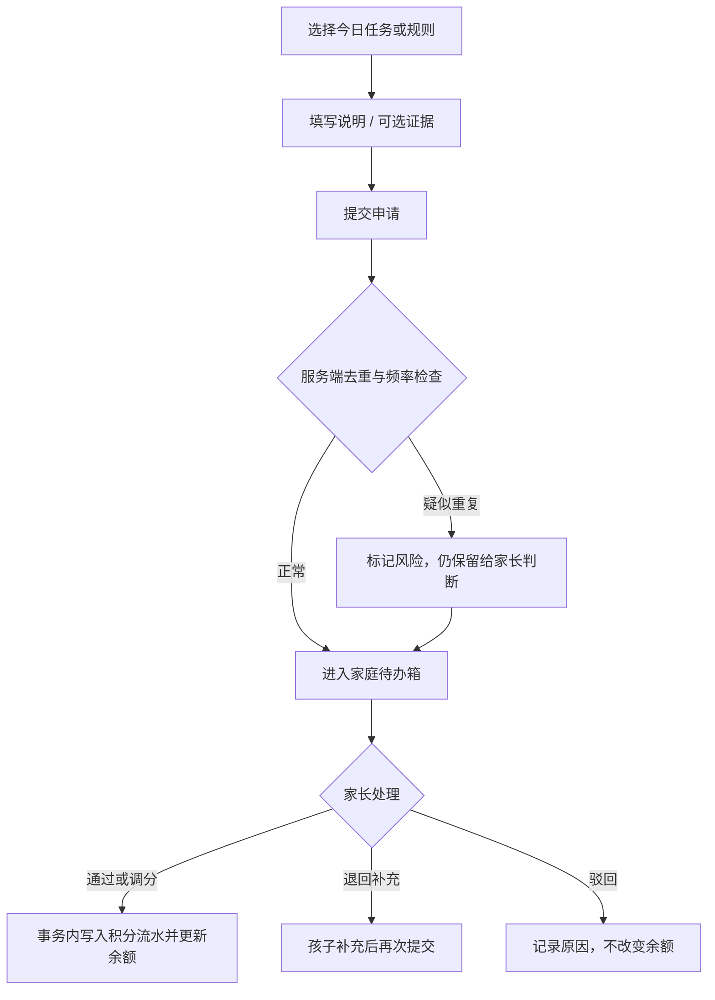
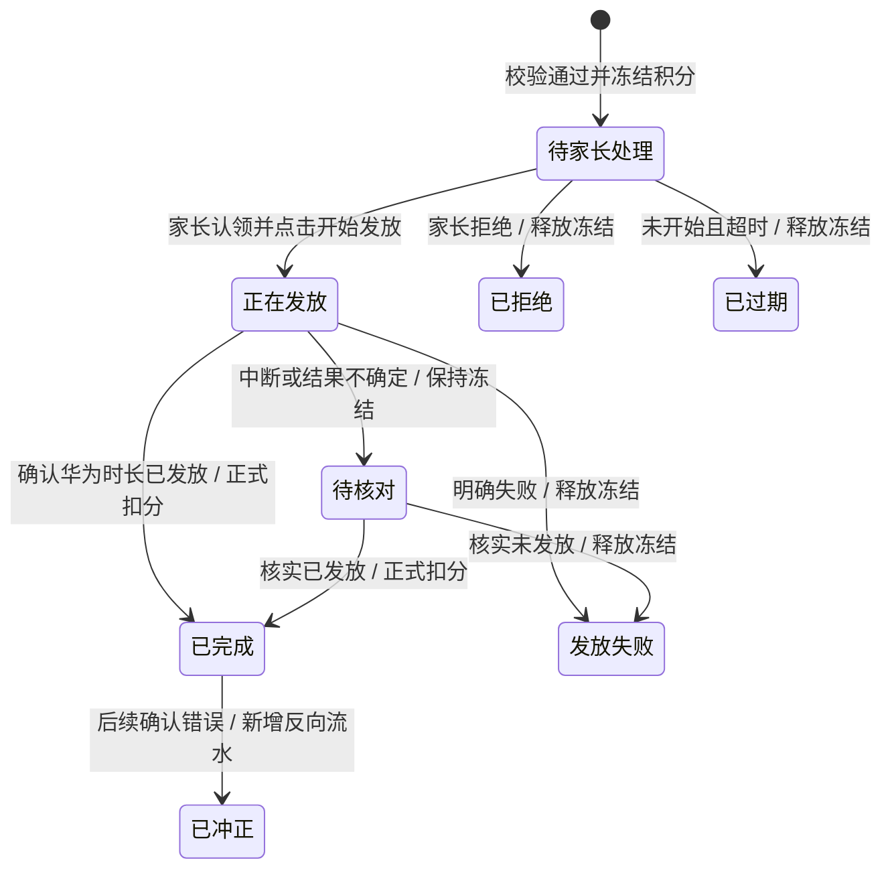

# 糖罐积分鸿蒙版 MVP 方案与推进计划

> 文档版本：v1.1（S14 synthetic 初始管理员与法律证据安全引导记录）
> 初版日期：2026-08-09；修订日期：2026-08-27
> 适用项目：糖罐积分微信小程序 / Web 管理端 / HarmonyOS 孩子端
> 当前决策：采用“无 Screen Time Guard ACL”路线；华为远程守护中的用机时长由家长手动发放。未成年人账号不再走 AppGallery 邀请测试或 AppTest；儿童真机安装改为正式上架后验收。

> 2026-08-19，华为开发者支持工单 `D635177` 书面确认：AppTest 不支持实名未成年人账号，当前也没有在“不切换成人账号、不关闭未成年人模式、不开启开发者模式”条件下分发测试应用的其他官方方案。因此本文废止“先在儿童账号邀请测试、再决定是否公开上架”的旧路线。

---

## 1. 决策摘要

糖罐积分继续使用现有后端和唯一积分账本，在此基础上增加一个面向孩子的 HarmonyOS 原生 App。孩子通过 App 查看积分、申报已完成事项、跟踪审批结果、申请用积分兑换用机时长；父母继续主要使用微信小程序，在空闲时间集中审批。

HarmonyOS 版本采用双轨验证与分发：

1. **成人预发布验证轨：** 邀请测试、模拟器、自动化测试、Mate 80 真机和必要的云测试只用于成人账号与受控设备，验证安装、启动、网络、业务、权限和回归。
2. **儿童正式使用轨：** 儿童账号只安装已通过 AppGallery 正式审核、内容分级适龄的公开版本；孩子设备保持未成年人模式和远程守护，不切换成人账号，不开启开发者模式。
3. **首发先核心后增强：** 历史 `0.1.0 (10000)` 仅为阶段 0 诊断包；当前跟踪的 `0.2.0 (20000)` 仍只是未连接外部服务、未发布且不完整的 S10 本地安全壳，S11～S14 也只补齐临时 synthetic 客户端工作区、服务端配置/预检、离线数据根和一次性初始引导工具，均不能直接公开上架。完成“监护人授权与配对 → 查看积分 → 申报任务 → 家长审批 → 查看结果 → 解绑/删除”的薄 MVP 及全部发布硬门后，才能生成正式首发候选版。
4. **渠道公开、功能克制：** AppGallery 首次正式发布不能使用分阶段发布。首发可以零推广，但必须对普通家庭具备真实、完整的基本价值，不能仅对白名单家庭或开发者自家设备可用。

范围口径：`0.2.0` 是用于取得正式儿童安装渠道的“正式首发基础版”，完成监护人授权、配对、积分查询、申报审批和数据权利闭环；阶段 6 完成人工用机兑换后，才达到本文定义的完整 MVP。照片、Push 等仍属于后续增强。

由于 `ohos.permission.MANAGE_SCREEN_TIME_GUARD` 当前只对企业开发者开放，本阶段不申请 ACL，不尝试读写华为“远程守护”或系统奖励积分，也不承诺自动增加设备可用时长。

用机时长采用可靠的人工闭环：

1. 孩子在糖罐提交兑换申请。
2. 服务端检查可用积分并冻结本次所需积分。
3. 任一家长可以审核；系统将实际发放任务交给具备华为远程守护能力的执行人。
4. 执行人进入华为远程守护，手动发放对应时长。
5. 执行人回到糖罐确认结果。
6. 发放成功才正式扣分；发放失败则释放冻结积分；结果不确定则进入“待核对”，不自动扣分或退款。

这条路线能够优先解决三个现实问题：

- 孩子在微信未成年人模式下无法稳定使用微信小程序。
- 父母忙碌时容易漏记孩子已经完成的事项。
- 家长批准华为用机时长前无法快速确认孩子是否有足够积分。

---

## 2. 产品目标与非目标

### 2.1 完整 MVP 目标

1. 让孩子主动申报已经完成的任务，降低父母漏记概率。
2. 让父母通过“家庭待办箱”集中审批，减少随时被打断。
3. 让用机时长申请先经过糖罐的积分校验，避免积分不足仍被批准。
4. 让积分、申请、审批、兑换和人工执行均有明确状态与审计记录。
5. 保持微信小程序、HarmonyOS App 和 Web 管理端共用同一家庭、同一规则和同一积分账本。

### 2.2 完整 MVP 阶段明确不做

- 不调用或模拟华为 Screen Time Guard Kit。
- 不读写华为远程守护中的系统奖励积分。
- 不自动增加或解除设备用机时间限制。
- 不自动判断作业完成质量。
- 不让孩子直接修改积分余额。
- 不依赖一次推送决定业务状态。
- 不采集位置、通讯录、通话记录等与产品无关的儿童数据。

### 2.3 核心原则

- **一个账本：** 现有 SQLite 积分流水仍是唯一事实来源。
- **申请不是入账：** 孩子提交申请不会直接改变余额。
- **通知不是凭据：** 推送只负责提醒，所有事项必须持久保存在待办箱。
- **先冻结、后执行：** 用机兑换先锁定可用积分，人工发放成功后才正式扣除。
- **结果可追溯：** 每次申请、认领、审批、改分、发放、取消和冲正都记录操作者与时间。
- **兼容优先：** 新 API 和新字段采用增量方式，不能破坏现有小程序接口。
- **正向激励：** 孩子主要申报“完成了什么”；纪律扣分仍由家长发起，孩子可以说明或申诉。
- **分发分轨：** 成人设备承担预发布验证，儿童设备只接收正式适龄版本；不能再把儿童邀请测试作为阶段退出条件。
- **身份解耦：** 华为账号只用于应用市场下载，糖罐内部身份由监护人创建的家庭、孩子档案和一次性设备配对确定，不采集孩子华为账号或共享家长密码。
- **授权先行：** 在监护人完成儿童个人信息处理授权前，不创建有效设备绑定，不上传可关联到孩子的业务数据。
- **首发克制：** 照片、Push、用机兑换和其他高风险能力默认关闭，核心纵向闭环稳定后再逐项启用。

---

## 3. 用户与设备范围

| 角色 | 主要设备 | 主要入口 | MVP 能力 |
|---|---|---|---|
| 恩赫、恩菲 | nova 14 活力版，HarmonyOS 6.1 | AppGallery 正式上架的 HarmonyOS 孩子端 | 查积分、报任务、查审批；后续申请用机时长 |
| 恩赫、恩菲 | MatePad 11.5，HarmonyOS 4.2 | 待兼容性验证 | 若不能安装原生 HAP，则使用降级方案 |
| 爸爸 | Mate 80 Pro Max，HarmonyOS 6.1 | 微信小程序；HarmonyOS 成人预发布验证设备 | 审批、批量处理、正式首发前回归；默认用机时长执行人 |
| 妈妈 | iPhone | 微信小程序 | 审批、批量处理、转交用机发放；当前不承担华为奖励执行 |

首个儿童正式试点仅覆盖两台 HarmonyOS 6.1 孩子手机。首次正式上架前，业务全流程先在成人设备、模拟器和自动化测试中完成；平板兼容性单独设立技术验证，不让 HarmonyOS 4.2 拖慢手机端 MVP。

正式内容分级前，由监护人在发布检查单中私下确认两名目标儿童账号所属的年龄区间，最终分级必须覆盖其中更低的年龄区间；不在本文、应用业务库或日志中记录精确生日。若问卷结果高于目标年龄，先调整真实功能/内容或接受不可见结论，不能人为降低分级。

---

## 4. 总体方案



### 4.1 三端职责

本节描述完整 MVP 责任边界。`0.2.0` 正式首发基础版只开放授权/配对、积分查询、文字申报、单条审批、结果查询和数据权利入口；冻结积分与用机兑换在阶段 6 开启，照片、Push 和批量增强在阶段 7 评估。

#### HarmonyOS 孩子端

- 显示总积分、冻结积分和可用积分。
- 显示今日任务、规则和可申报事项。
- 提交完成说明与可选证据。
- 查看待审批、待补充、已通过、已驳回结果。
- 选择用机时长套餐并提交兑换申请。
- 查看兑换进度和家长反馈。
- 通过安全配对绑定家庭和具体孩子，不使用共享家长密码。

#### 家长微信小程序

- 新增统一“家庭待办箱”。
- 支持单条审批、调分、退回补充和驳回。
- 支持低风险申请批量通过。
- 显示疑似重复、超期、高分值等风险标记。
- 认领用机兑换并进入人工发放引导。
- 确认“已成功发放 / 发放失败 / 稍后核对”。
- 区分审批人与执行人；妈妈可批准或转交，爸爸作为当前默认华为远程守护执行人。
- 提供“随手记”，先记事件、以后补规则和分值。
- 在首页提供孩子可用积分的快速查看入口。

#### 后端与 Web 管理端

- 管理申请、冻结、审批、兑换状态机与审计日志。
- 在数据库事务中完成余额校验、预约冻结和正式入账。
- 管理兑换套餐、每日额度、允许时段和审批规则。
- 提供异常订单、超时申请、重复申报与冲正工具。
- 保持既有家庭隔离、规则版本和积分流水逻辑不回归。

### 4.2 双轨分发与身份边界

| 轨道 | 适用对象 | 允许渠道 | 通过标准 |
|---|---|---|---|
| 成人预发布验证 | 开发者、家长和受控成人设备 | AppGallery 邀请测试、模拟器、自动化测试、Mate 80、必要的云测试 | 安装、启动、权限、网络、完整业务闭环与回归均通过 |
| 儿童正式使用 | 实名未成年人账号、未成年人模式设备 | AppGallery 正式上架且内容分级适龄的版本 | 应用市场安装、远程守护批准、系统使用许可和真实家庭闭环均通过 |

华为账号不是糖罐业务账号。任何家庭均应由监护人在家长端创建孩子档案并明确授权，再生成一次性配对码；孩子端只获得绑定到 `familyId + childId + deviceId` 的最小设备凭证。没有配对码的公开下载者应看到清晰的家长开通说明或可用的审核演示路径，而不是空白页、内部诊断页或仅对白名单开放的错误提示。

---

## 5. 核心业务流程

### 5.1 孩子设备配对

1. 家长端先展示相互独立并分别版本化的《隐私政策》《儿童个人信息保护规则》《儿童用户协议》、儿童个人信息监护人同意及单独敏感信息告知；未同意前如需填写孩子别名，只保存在家长设备本地草稿中，不上传后端。
2. 监护人账号重新认证并作出法定监护关系声明、分别完成必要同意后，服务端通过“同意并创建孩子”集合事务创建/激活孩子档案，同时记录文本版本/摘要、同意时间、账号重新认证方式与时间、关系声明、`familyId + childId` 及后续撤回记录。MVP 默认不采集身份证件影像；若监管、华为审核或争议处理要求更强监护关系核验，必须先补充最小化核验方案、告知、保留期限和 PIPIA，再启用对应处理。
3. 家长在微信小程序选择一个孩子，服务端生成至少 128 bit 随机的完整配对挑战，并提供一次性 6 位人工短码；首发只支持手工输入短码，不申请相机权限，二维码扫码留到后续评估。
4. 完整挑战和短码共同绑定 `familyId + childId`，有效期建议 10 分钟且只能使用一次。短码只作为受限检索入口，必须按家庭、设备/IP 和时间窗限速，连续错误达到阈值后锁定并重新生成。
5. 孩子端输入 6 位配对码，服务端在严格限速和尝试次数控制下定位并核验完整配对挑战。
6. 服务端向家长端显示最小必要的设备信息和申请绑定的孩子。
7. 家长二次确认只把配对推进到 confirmed；孩子端还必须使用 HUKS P-256 私钥对服务端分域 challenge 签名，并以原 claim、签名和幂等键调用完成接口。
8. 服务端同时核验家长确认、设备 proof、当前监护授权与家庭/儿童/设备作用域后，才激活绑定并签发短期 Access Token 与可轮换 Refresh Token。
9. 设备丢失、转让、授权撤回或异常时，家长可立即撤销绑定，旧令牌即时失效。

安全要求：完整配对挑战使用至少 128 bit 随机值，服务端只保存摘要；6 位短码本身不宣称具有 128 bit 熵，安全性依赖短有效期、单次使用、限速、错误锁定和家长二次确认。孩子端在 HarmonyOS 安全存储中生成不可导出的设备密钥，家长确认时同时核对孩子和设备。孩子端不保存父母密码；昵称不能作为身份主键；每台设备拥有独立设备 ID、公钥和凭证。

第二监护人或其他家庭成人必须通过独立受认证账号被邀请。只有重新认证并单独作出监护关系声明的账号才能代表儿童作出同意或行使儿童数据权利；未完成该步骤的家庭成人只获得监护人明确授予的业务操作范围，不能自动查看全部儿童数据、修改授权或发起删除。邀请、核验、授权范围、撤销和可见范围均须留痕。

### 5.2 孩子申报加分



每条规则可配置：

- 默认分值与家长可调整范围。
- 每日或每周最多申报次数。
- 是否要求说明或照片。
- 是否允许重复完成。
- 申报截止时间与补报期限。

防重策略：

- 以“家庭 + 孩子 + 规则 + 任务周期”识别疑似重复。
- 客户端每次提交生成 `clientRequestId`，网络重试必须复用同一 ID。
- 已提交规则显示“审批中”，避免再次点击。
- 家长审批时再次检查是否已有对应入账流水。
- 疑似重复不静默删除，而是显示给家长判断。

### 5.3 家长集中审批

家庭待办箱统一收纳：

- 待审批加分申请。
- 待补充材料申请。
- 用机时长兑换申请。
- 正在人工发放的兑换。
- 待核对异常。
- 父母“随手记”但尚未正式记分的事件。

建议提供“30 秒结算模式”：

1. 优先展开高分值、疑似重复、超期或需查看证据的申请。
2. 普通申请按孩子、日期和规则批量勾选。
3. 提交前汇总“通过多少条、恩赫增加多少、恩菲增加多少”。
4. 一次确认后原子入账，并显示剩余待办。

双亲并发保护：一名家长打开处理后可点击“认领”，另一名家长看到“爸爸处理中 / 妈妈处理中”；最终审批仍由服务端 revision 或条件更新防止重复执行。

用机兑换允许“审批人与执行人”不同。妈妈可以在 iPhone 上完成积分规则审核，但由于当前没有华为奖励卡片，可将“待发放”任务转交给爸爸；冻结积分保持不变，直到爸爸确认成功、失败或转为待核对。

### 5.4 用积分申请用机时长

推荐家庭规则改为：**先在糖罐申请并通过积分校验，再由家长去华为远程守护发放。**



数据库状态映射：`reserved=待家长处理`、`applying=正在发放`、`review=待核对`、`committed=已完成`，`failed/rejected/expired/reversed` 分别对应发放失败、已拒绝、已过期和已冲正。只有 `reserved`、`applying`、`review` 计入冻结积分；创建成功后直接写入 `reserved`，不使用未定义的 `active` 或中间 `requested` 状态。

孩子端流程：

1. 选择 15 或 60 分钟套餐；华为远程守护当前不提供 30 分钟额外申请，因此糖罐不设置 30 分钟档。
2. 查看所需积分、可用积分、今日已兑换时长与允许时段。
3. 服务端在同一事务内检查可用积分和有效申请。
4. 条件满足则创建兑换并冻结积分；条件不满足立即说明还差多少分。

家长端发放页必须显示：

- 孩子姓名和目标设备。
- 当前总积分、冻结积分、可用积分。
- 本次消耗、扣除后余额。
- 申请时长与今日累计兑换时长。
- 华为远程守护的人工操作提示。
- “已成功发放 / 发放失败 / 稍后核对”三个结果按钮。

关键规则：

- 同一孩子同一时刻只允许一个有效用机兑换申请。
- 暑假模式下，每个孩子的手机和平板共用每天 120 分钟总额度，不按设备分别计算；每日统计按 `Asia/Shanghai` 自然日归集。
- 允许用机时间窗为 11:00～14:00、21:00～23:00。创建申请时，服务端同时校验当前处于允许时段，并且所选套餐能在当前时间窗结束前完整使用。
- 例如 13:30 不再允许申请 60 分钟档，但仍可申请 15 分钟档；13:50 不允许新申请任何档位，避免奖励时长跨过 14:00。
- 当天所有设备已完成和活动冻结订单的分钟数合计达到 120 分钟后，不再接受新申请。
- “待家长处理”可在配置时限后自动过期并释放积分。
- 一旦进入“正在发放”，系统不能自动退款，因为家长可能已在华为侧完成操作。
- “待核对”期间保持冻结，并禁止新的用机兑换申请。
- 孩子的“已收到 / 未收到”反馈只作为核对线索，不能单独决定扣分。
- 华为远程守护原生申请无法被糖罐拦截；家长收到原生申请时，应先查看糖罐可用积分。
- HarmonyOS 6 的系统奖励存在每日发放/兑换次数限制，试点时必须核实当前规则以及奖励作用于孩子账号还是具体设备；兑换套餐应尽量一次覆盖合理时长，避免频繁消耗系统次数。

### 5.5 惩罚、纠错与申诉

- 纪律扣分由家长创建，避免要求孩子主动“申请被扣分”。
- 孩子可以对扣分记录提交情况说明或申诉。
- 家长发现记错时不删除原流水，而是新增冲正流水并记录原因。
- 孩子主动申请“花积分”统一走兑换流程，不混入普通加分申报。

### 5.6 防遗漏设计

- 孩子端显示固定“今日任务”，完成后主动申报。
- 父母端提供“随手记”：只选孩子并写一句话即可暂存，不立即入账。
- 所有未处理事项持久化在待办箱；关闭 App 或通知丢失不会消失。
- 每次进入前台主动刷新待办数量。
- 支持固定晚间汇总提醒和超时转交另一位监护人。
- 申请显示等待时长，例如“已等待 6 小时”，但不自动认定完成或失败。

---

## 6. 页面与交互范围

页面清单覆盖完整 MVP：`0.2.0` 首发提供第 1、2、3（不含证据上传）、4、6、7 页；“时长兑换”在阶段 6 才开放，二维码扫码、照片和 Push 设置在阶段 7 评估。

### 6.1 HarmonyOS 孩子端页面

1. **首次配对**：首发手工输入 6 位配对码、设备信息、等待家长确认；二维码扫码作为后续可选能力。
2. **今日首页**：总积分、冻结积分、可用积分、今日任务、待审批数。
3. **任务申报**：规则说明、默认分值、证据、补充说明、提交确认。
4. **我的申请**：待审批、待补充、已通过、已驳回及家长反馈。
5. **时长兑换**：套餐、积分成本、允许时段、每日限额和进度。
6. **积分记录**：只读展示本人的流水和余额变化。
7. **设置**：设备名称、通知、儿童易懂版隐私摘要、完整隐私文本、解绑申请和版本信息。

2026-08-26 S10 只完成其中的工程安全说明子集：单页本地视图展示通用设备别名、版本、受控网络/备份/通知状态、数据类别、可见范围和生产硬门，不读取动态身份，也不提供解绑、删除或同意动作。它显著标注不是正式隐私政策、儿童规则、用户协议或同意页面；完整儿童易懂摘要、正式文本、客服/投诉、真实行权入口和产品/可访问性验收仍未完成。

### 6.2 家长微信小程序新增页面/模块

1. 家庭待办箱。
2. 批量审批页。
3. 单条申请详情与证据查看。
4. 用机时长人工发放引导页。
5. 待核对异常页。
6. 随手记。
7. 兑换套餐与时段设置。
8. 设备绑定与撤销管理。
9. 家庭操作审计记录。
10. 默认用机执行人及转交设置。
11. 监护人授权记录、撤回同意、儿童资料查阅/导出/更正/删除和家庭服务终止入口。

### 6.3 角色化文案

- 孩子端使用“我完成了”“等待爸爸妈妈确认”“还差 10 分”等可理解文案。
- 家长端使用“待确认”“建议分值”“疑似重复”“开始人工发放”等操作文案。
- 不使用“数据库事务、预占、幂等”等技术词直接面向家庭用户。

---

## 7. 技术架构方案

### 7.1 基础约束

- 继续使用现有 Express + SQLite 后端。
- 继续使用现有家庭隔离、用户角色、规则稳定 ID、流水规则 ID 和规则版本历史。
- 现有积分流水与余额更新必须继续保持原子事务。
- 所有新增迁移使用独立编号，迁移前备份并提供回滚步骤。
- 不修改现有 API 的路径和旧字段语义；新增接口和字段保持旧客户端可用。

### 7.2 建议新增数据对象

#### `guardian_consents`

| 字段 | 用途 |
|---|---|
| `id` | 授权记录稳定 ID |
| `family_id` / `child_id` / `guardian_id` | 家庭、孩子与监护人关联 |
| `privacy_version` / `child_rules_version` / `child_user_agreement_version` | 同意时展示的隐私、儿童规则和儿童用户协议版本 |
| `sensitive_notice_version` / `text_hashes` | 单独敏感信息告知版本及不可变文本摘要 |
| `guardian_relation` / `relation_declaration_version` | 监护关系声明及其文本版本；家庭管理员不自动等于法定监护人 |
| `verification_method` / `verified_at` | 账号重新认证与关系声明的最小核验方式和完成时间；不默认保存身份证件影像 |
| `consent_scope` | 儿童信息、单独敏感信息及可选能力的授权范围 |
| `visibility_scope` | 该监护人或家庭成人被授予的儿童数据与业务操作范围 |
| `privacy_consented_at` / `child_rules_consented_at` / `child_user_agreement_accepted_at` | 三份独立文本的确认/接受时间 |
| `sensitive_consented_at` / `withdrawn_at` | 儿童敏感个人信息单独同意与撤回时间 |
| `status` | active / withdrawn / superseded |
| `audit_data` | 最小必要的授权审计信息，不保存无关设备指纹 |

#### `pairing_challenges`

| 字段 | 用途 |
|---|---|
| `id` | 服务端完整配对挑战的稳定 ID，不暴露为孩子端输入 |
| `family_id` / `child_id` / `issued_by_guardian_id` | 配对目标及签发监护人 |
| `challenge_hash` | 至少 128 bit 完整挑战的摘要，不保存明文 |
| `short_code_lookup` | 6 位短码的服务端密钥 HMAC/受保护索引，用于限时查找；不得明文持久化 |
| `status` | pending / claimed / confirmed / expired / locked / cancelled |
| `attempt_count` / `locked_at` | 尝试次数、限速与错误锁定 |
| `claimed_device_public_id` / `claimed_public_key` | 申领设备的随机绑定标识与公钥 |
| `expires_at` / `claimed_at` / `confirmed_at` | 10 分钟有效期、申领与家长确认时间 |

#### `device_bindings`

| 字段 | 用途 |
|---|---|
| `id` | 设备绑定稳定 ID |
| `family_id` / `child_id` | 明确家庭与孩子归属 |
| `device_public_id` | 应用随机生成的设备绑定标识；与儿童关联后按儿童敏感个人信息保护，不使用硬件标识或广告标识 |
| `device_public_key` | 设备不可导出私钥对应公钥，用于 challenge 签名验证 |
| `device_alias` | 应用生成或由监护人填写的设备别名，作为常规识别字段 |
| `model` / `os_version` | 默认不采集的诊断字段；仅在独立诊断开关、明确目的和期限下处理 |
| `credential_hash` | 设备凭证摘要，不保存明文 |
| `push_token` | 可为空，后续启用 Push Kit |
| `status` | pending / active / revoked |
| `last_seen_at` | 异常与失联判断 |

#### `device_sessions`

| 字段 | 用途 |
|---|---|
| `id` / `device_binding_id` | 会话稳定 ID 与设备绑定 |
| `refresh_token_hash` | 轮换 Refresh Token 摘要，不保存明文 |
| `token_family_id` / `rotation_counter` | 识别旧 Token 重用和整组撤销 |
| `issued_at` / `expires_at` / `last_used_at` | 会话生命周期 |
| `revoked_at` / `revoke_reason` | 设备撤销、授权撤回或异常重用记录 |

#### `point_requests`

| 字段 | 用途 |
|---|---|
| `id` | UUID |
| `family_id` / `child_id` / `applicant_id` | 家庭隔离与申请人 |
| `rule_id` / `category_id` | 稳定规则关联 |
| `reason_snapshot` | 保留提交时名称，兼容规则改名 |
| `requested_points` | 孩子建议分值，服务端校验范围 |
| `approved_points` | 家长最终批准分值 |
| `description` / `evidence_ref` | 说明与可选证据 |
| `occurred_at` | 实际发生时间 |
| `status` | pending / needs_info / approved / rejected / cancelled |
| `client_request_id` | 设备端幂等键 |
| `reviewer_id` / `reviewed_at` / `decision_note` | 审批审计 |
| `transaction_id` | 通过后关联唯一积分流水 |
| `revision` | 防并发覆盖 |

#### `time_redemptions`

| 字段 | 用途 |
|---|---|
| `id` | UUID |
| `family_id` / `child_id` / `device_binding_id` | 兑换主体与设备 |
| `minutes` / `point_cost` | 时长和成本快照 |
| `status` | reserved / applying / review / committed / failed / rejected / expired / reversed |
| `claimed_by` / `claimed_at` | 家长认领 |
| `approved_by` / `executor_id` | 区分规则审核人与华为操作执行人 |
| `expires_at` | 尚未开始发放时的过期时间 |
| `committed_transaction_id` | 成功后唯一扣分流水 |
| `client_request_id` | 防重复提交 |
| `revision` | 防双亲重复操作 |
| `note` / `audit_data` | 人工核对说明 |

#### `notification_outbox`

保存待发送通知及重试状态。业务事务只写 Outbox，异步任务再发送微信提醒或 HarmonyOS Push；即使推送失败，待办仍然存在。

#### `data_rights_requests`

| 字段 | 用途 |
|---|---|
| `id` | 行权请求稳定 ID |
| `family_id` / `child_id` / `guardian_id` | 请求主体及家庭隔离 |
| `request_type` | access / export / correct / withdraw / delete / terminate |
| `status` | requested / verified / processing / completed / rejected |
| `requested_at` / `completed_at` | 请求与完成时间 |
| `retention_decision` | 对积分流水、审计和法定保留数据的处置依据 |
| `result_receipt` | 可向监护人展示的处理回执，不保存导出数据正文 |

### 7.3 可用积分计算

```text
总余额 = 已生效积分流水之和
冻结积分 = 所有 `reserved`、`applying`、`review` 兑换订单 point_cost 之和
可用积分 = 总余额 - 冻结积分
```

创建兑换时必须在同一数据库事务内：

1. 读取并锁定/串行化孩子当前余额与活动冻结。
2. 重新计算可用积分。
3. 检查时段、每日额度和是否已有有效申请。
4. 插入兑换订单并提交。

确认发放成功时必须在同一事务内：

1. 校验订单仍为可提交状态及 revision 正确。
2. 插入唯一负分流水。
3. 原子更新余额。
4. 将订单标记为 committed 并关联流水。

取消或失败只改变冻结订单状态，不产生扣分流水。后续修正使用新的反向流水，不直接修改或删除原流水。

积分流水建议新增可选来源字段 `source_type` 和 `source_id`，并对二者建立唯一约束。审批申请使用 `source_type=point_request`，用机兑换使用 `source_type=time_redemption`，从数据库层保证重复请求只会入账一次。

### 7.4 建议新增 API（草案）

| 方法与路径 | 用途 |
|---|---|
| `POST /api/v2/device-pairings` | 家长创建一次性配对码 |
| `POST /api/v2/device-pairings/claim-by-code` | 孩子设备提交 6 位短码、公钥与随机设备绑定标识；服务端限速定位有效挑战并返回不透明申领 ID |
| `POST /api/v2/device-pairings/claim/complete` | 孩子设备提交 HUKS 私钥签名，完成 proof 后激活绑定并取得首代设备会话 |
| `GET /api/v2/device-pairings/:id` | 家长按本人家庭与监护范围恢复配对状态 |
| `POST /api/v2/device-pairings/:id/confirm` | 家长确认绑定 |
| `GET /api/v2/devices` | 家长列出本人当前有权管理的设备与会话最小信息 |
| `DELETE /api/v2/devices/:id` | 家长撤销设备 |
| `POST /api/v2/devices/:id/session-challenges` | 服务端签发设备会话签名 challenge |
| `POST /api/v2/device-sessions/refresh` | 验证设备签名并轮换 Refresh Token |
| `DELETE /api/v2/device-sessions/:id` | 撤销单个设备会话或整组 Token |
| `GET /api/v2/me/summary` | 设备只读取当前绑定孩子的别名与积分余额 |
| `GET /api/v2/me/transactions` | 设备只读取当前绑定孩子的最小流水与作用域绑定游标 |
| `GET /api/v2/me/reward-rules` | 设备只读取当前家庭可申报鼓励规则的最小规范化快照与作用域绑定游标 |
| `GET /api/v2/me/point-requests` | 设备读取当前绑定孩子的申请 |
| `GET /api/v2/point-requests` | 家长读取本人当前授权范围内的家庭待办 |
| `POST /api/v2/point-requests` | 孩子提交积分申请 |
| `PATCH /api/v2/point-requests/:id` | 孩子按 revision 补充并重新提交申请 |
| `POST /api/v2/point-requests/:id/cancel` | 孩子取消仍可取消的本人申请 |
| `POST /api/v2/point-requests/:id/request-info` | 家长退回补充材料 |
| `POST /api/v2/point-requests/:id/approve` | 家长批准或调分 |
| `POST /api/v2/point-requests/:id/reject` | 家长驳回 |
| `GET /api/v2/time-redemptions` | 查询本人/家庭兑换 |
| `POST /api/v2/time-redemptions` | 校验并冻结积分 |
| `POST /api/v2/time-redemptions/:id/claim` | 家长认领并开始发放 |
| `POST /api/v2/time-redemptions/:id/complete` | 确认成功并正式扣分 |
| `POST /api/v2/time-redemptions/:id/fail` | 确认失败并释放冻结 |
| `POST /api/v2/time-redemptions/:id/review` | 转入待核对 |
| `GET /api/v2/family/tasks/summary` | 家庭待办汇总与角标 |
| `POST /api/v2/child-enrollments` | 监护人账号重新认证、关系声明与各项同意通过后，在同一事务中创建/激活孩子档案并写入授权记录 |
| `POST /api/v2/children/:id/consents` | 已有孩子档案因文本更新、授权范围变化或重新同意而新增不可变授权版本 |
| `POST /api/v2/children/:id/consents/withdraw` | 监护人撤回授权、停止新增处理并撤销设备凭证 |
| `GET /api/v2/children/:id/data-export` | 监护人查阅和导出儿童数据 |
| `POST /api/v2/children/:id/data-rights-requests` | 提交查阅、导出、更正、删除或终止服务请求 |
| `GET /api/v2/data-rights-requests/:id` | 查询验证、处理、保留决定和完成回执 |

所有写接口要求：当前数据库中的角色与 `familyId` 校验、严格输入校验、幂等键、请求审计和统一错误码。请求体中的 `familyId` 只能作为目标一致性校验，授权范围必须从当前 Token 对应的数据库身份推导。

孩子设备令牌还必须绑定当前 `childId`；同一家庭内，孩子 A 不能读取孩子 B 的积分、申报、设备或以孩子 B 身份提交请求。家长的家庭级权限与孩子的本人权限分别建模和测试。

### 7.5 设备会话与令牌

- Access Token 当前固定有效 15 分钟，只包含最小身份线索；服务端每次从数据库读取当前角色、家庭和设备状态。
- Refresh Token 当前固定 30 天截止、每次刷新轮换，只有 Access 剩余不超过 5 分钟时才能签发单个 pending challenge；服务端仅存摘要并绑定设备。
- 刷新时由设备私钥签名服务端 challenge。客户端在发出请求前持久化旧 Refresh、challenge、签名和幂等键；结果未知时只允许在服务端重放窗口内原样重试。检测到不同请求重用旧 Refresh 或精确重放窗口结束时，撤销该设备整组会话。
- 家长撤销设备、孩子转家庭或用户被禁用后，旧 Access/Refresh Token 均应立即失效。
- Token、设备私钥和 Push Token 不进入日志；设备私钥只在 HUKS ECE 中使用，Access/Refresh 与恢复意图只保存在禁止同步/备份的 AssetStore 中。

### 7.6 通知策略

通知策略的分阶段优先级：

1. 家长小程序待办箱与角标。
2. 前台刷新与定时轮询补偿。
3. 微信订阅消息（需家长授权且受模板规则限制）。
4. 阶段 7 才评估 HarmonyOS 孩子端 Push Kit，用于审批结果与补充材料提醒。
5. 阶段 7 才评估爸爸端轻量家长模式，通过 Push Kit 接收“待发放”通知并直达订单；妈妈仍使用微信小程序。
6. 阶段 7 评估晚间汇总和第二监护人超时提醒。

Push Kit 属于普通开放能力，可在通知模块进入开发时再启用；它与 Screen Time Guard ACL 无关。任何推送到达回执都不能替代数据库状态。

### 7.7 迁移、灰度与回滚

- 使用纯增量迁移，例如 `006_devices_sessions.sql`、`007_point_requests.sql`、`008_time_redemptions.sql`、`009_transaction_sources_audit.sql`；实际编号实施时以仓库现有迁移为准。
- 部署顺序严格为：旧库备份 → SHA-256 → `PRAGMA integrity_check` → 部署兼容后端 → 执行迁移 → 核对家庭、余额与流水 → 使用后端功能开关逐项启用。
- 使用 `harmony_child_enabled`、`point_requests_enabled` 作为全局应急止损开关；正式首发正常状态下必须对所有符合条件的普通家庭开启，不得把核心功能限制成自家白名单测试。`time_redemptions_enabled`、照片和 Push 等增强能力可在对应阶段按家庭或比例逐步启用。
- 回滚优先关闭功能开关并回退代码，新增表保留；不得为回滚直接删除已经产生的申请和审计数据。
- 服务端功能开关不等于 AppGallery 渠道灰度或私有分发。首次正式上架不能使用分阶段发布；首发核心功能必须对所有符合条件的普通家庭真实可用。后续版本更新才可结合 AppGallery 分阶段发布降低升级风险。

---

## 8. HarmonyOS 兼容策略

### 8.1 手机先行

- 首批目标设备：两台 nova 14 活力版，HarmonyOS 6.1.0.135。
- 使用 ArkTS + ArkUI 开发原生孩子端。
- `0.1.0 (10000)` 保留为阶段 0 诊断版：儿童账号邀请失败作为平台限制证据归档，此后只用于成人账号和成人设备完成发布链路验证，不提交正式上架。
- 首个儿童可安装版本建议为 `0.2.0 (20000)`，只包含“监护人授权与配对、查积分、文字申报、家长审批、查看结果、解绑/删除”薄闭环；照片、Push、用机兑换和第三方统计默认关闭。
- 正式首发范围为中国大陆、手机、免费、无广告与支付；按真实功能完成内容分级和完整审核。首发可以不做市场推广，但属于公开正式上架，不能伪装成只对自家开放的测试应用。
- 首次正式发布不能使用 AppGallery 分阶段发布；后续版本更新可在平台允许的范围内采用分阶段发布。

版本线统一如下：

| 用途 | versionName | versionCode | 定位 |
|---|---:|---:|---|
| 阶段 0 诊断与成人邀请测试 | 0.1.0 | 10000 | 发布链路、工单和成人技术基线证据；不再作为儿童测试渠道 |
| 首次正式候选 | 0.2.0 | 20000 | 薄 MVP，首次正式公开发布 |
| 上架后紧急修复 | 0.2.1 | 20001 | 仅用于首发核心闭环修复；可按平台能力评估分阶段更新 |
| 下一功能里程碑 | 0.3.0 | 30000 | 人工用机兑换闭环；Push、照片等增强不在此表预先绑定版本号 |

所有版本保持同一 App ID、`cn.hefeijifen.tangguan` 和兼容的发布签名身份；每次构建使用当时有效的 RELEASE 证书与 AppGallery 发布 Profile，证书/Profile 到期、续期或轮换按华为官方流程执行。正式更新的 `versionCode` 必须单调递增。项目不依赖把 `0.1.0` 邀请测试任务直接转换为正式版，而是为 `0.2.0` 构建新的正式候选包并创建正式发布任务。

### 8.2 平板验证门

两台 MatePad 11.5 当前记录为 HarmonyOS 4.2，而手机工程最低兼容 API 20（HarmonyOS 6.0）。在没有官方兼容依据前，不向这两台儿童平板分发或尝试安装当前 HarmonyOS 6 `.app`，也不为验证而切换成人账号、关闭未成年人模式或开启开发者模式。

验证顺序：

1. 获取平板设置中的准确型号、HarmonyOS 软件版本与可用 API 能力。
2. 通过官方兼容资料、模拟器、云测试或成人控制的同类设备完成预判；儿童平板不承担预发布安装测试。
3. 只有未来官方系统升级或正式商店兼容结果证明可用时，才在正式上架后由儿童账号正常安装并纳入响应式布局验收。
4. 若长期不兼容，单独评估 Android/HMS APK 或受控 Web/PWA 降级版；新分发渠道必须重新核对未成年人模式和合规要求。
5. 平板降级版只提供查积分、申报和查状态，不承担系统用机控制，也不阻塞手机端正式首发。

### 8.3 未成年人模式

- 孩子端不依赖微信，因此不受微信青少年模式对小程序的限制。
- 华为工单 `D635177` 已确认 AppGallery 邀请测试、AppTest 及其他测试分发均不能在当前未成年人模式下完成本项目所需的儿童安装；该限制不再继续排障，也不通过换成人账号、关闭未成年人模式或开启开发者模式绕过。
- 只有通过 AppGallery 正式审核且内容分级适龄的版本，才进入儿童账号的正常应用市场安装路径。
- 家长的安装或使用批准不能覆盖 AppGallery 的适龄展示资格；若儿童账号看不到应用，必须先检查正式发布状态、内容分级、地区和设备范围。
- 未接入系统未成年人模式联动的应用可能默认不可使用；孩子可发起“申请使用/临时使用”，由家长通过远程守护或家长密码批准。此步骤纳入正式首发后的真机验收。
- 糖罐从产品设计上始终提供儿童安全界面，当前业务身份方案不依赖 Account Kit。是否必须接入系统未成年人模式联动仍以华为正式审核和目标系统能力为准；如被要求在提交前接入，或后续主动接入，必须重新评估新增 OpenID、年龄等数据及隐私声明。
- 仍需在华为“健康使用设备”中将糖罐 App 设为允许使用或足够长的使用时段，否则孩子可能无法打开申请入口。
- 必须真机验证孩子是否可以卸载、清数据或撤销通知权限，并在产品中给家长明确提示。

---

## 9. 儿童个人信息与正式发布合规基线

### 9.1 首发必须满足

1. **统一高标准：** 孩子端所有儿童档案统一按“不满 14 周岁”标准保护，不为核龄额外采集精确生日；儿童个人信息全部按敏感个人信息管理。
2. **监护人授权闭环：** 孩子不得自助注册，也不能由孩子点击“同意”代替监护人授权。监护人账号先重新认证并作出法定监护关系声明，分别确认《隐私政策》《儿童个人信息保护规则》《儿童用户协议》以及不满 14 周岁儿童个人信息的监护人单独同意，再通过集合事务创建/激活孩子档案和生成配对码。可选照片等新增敏感处理须单独授权，拒绝不得影响基础功能。
3. **授权可证明：** 后端保存各文本版本和摘要、一般与单独同意时间、监护关系声明版本、监护人账号、`familyId + childId`、授权范围和撤回记录；区分“家庭管理员”与“儿童法定监护人”。文本实质变化时重新取得有效同意。
4. **完整数据清单与最小化：** 首发业务数据包括内部家庭/孩子 ID、儿童别名、任务申请、积分与审批记录；授权数据包括监护人关联、关系声明、同意版本和时间；设备与安全数据包括随机绑定标识/公钥、凭证摘要、必要时间戳、`last_seen_at` 以及依法或安全所必需的网络/审计日志。设备名称、型号和系统版本默认不采或设为可空，仅在明确诊断场景处理。不得收集儿童手机号、华为账号、真实姓名、精确生日、位置、通讯录、短信、麦克风或广告标识。最终清单必须与代码、日志、云服务、隐私文本和市场标签逐项对齐。
5. **首发关闭照片：** `evidence_ref` 保留结构但功能开关默认关闭。后续如启用，照片必须可选，拒绝不影响核心功能；使用系统 Picker 单次选择，不申请相册全量权限或常驻相机权限；图片鉴权访问、使用短期地址并按公示期限自动删除。
6. **公开文本与易懂告知：** 开发者以自身名义通过 HTTPS 分别发布独立《隐私政策》《儿童个人信息保护规则》和《儿童用户协议》，三份文本分别版本化、生成不可变摘要并在 App 内随时可访问；首次授权时另提供清晰易懂、适合监护人与儿童理解的显著摘要。文本至少覆盖处理者及联系方式、数据种类、目的/方式、境内存储地点、明确期限、拒绝后果、安全措施、家庭成员可见范围、第三方/SDK/云服务、查阅/复制/更正/删除/撤回/投诉渠道，以及处理儿童敏感信息的必要性和影响。
7. **监护人身份与权利入口：** MVP 的最小核验方式是“监护人账号重新认证 + 明确法定监护关系声明”，记录 `verification_method` 与 `verified_at`，不把家庭管理员身份等同于法定监护关系。完成上述步骤的监护人可发起查阅/导出、更正、删除、撤回同意、解绑设备和终止服务请求；高风险操作须再次认证。若需更强证明，先完成最小化核验、告知、保留期限和 PIPIA。撤回后立即停止新增处理并撤销设备凭证，再按公开规则删除、匿名化或保留必要记录并提供回执。
8. **存量数据整改与全链评估：** 阶段 1 盘点现有小程序、Web、SQLite、备份和日志中的儿童、积分、规则与流水数据，并对每一类数据作出可核验结论：具有有效监护人同意与明确保留依据；重新取得同意后再使用；或删除/匿名化。对无法证明依据的数据，所有小程序、Web、HarmonyOS 和共享后端立即停止对应新增业务处理与跨端共享，不得只禁止 HarmonyOS 端读取。个人信息保护影响评估（PIPIA）覆盖小程序、Web、HarmonyOS、共享后端、当前云托管、家庭成员共享、留存/删除、安全事件及未来可选照片；评估报告和处理记录至少保存 3 年。
9. **安全与负责人：** 指定儿童个人信息保护负责人及联系方式，定期开展个人信息合规审计。全程 HTTPS；儿童信息和证据加密存储；配对挑战与 Refresh Token 只保存摘要；设备密钥不可导出；严格家庭隔离和最小员工权限；普通日志不得包含儿童照片、任务说明正文、手机号、令牌或其他敏感内容；建立数据泄露、毁损和丢失的补救、监管报告与监护人通知预案。
10. **现有与未来第三方：** 首发不接广告、第三方统计或非必要崩溃 SDK；同时盘点现有云主机、对象存储、短信、监控等受托处理方。委托前完成安全评估和书面约束，明确处理目的/期限、最小数据、未经授权不得转委托、服务终止返还或删除及监督责任。向非受托第三方提供儿童数据前，另行完成 PIPIA、明确告知接收方与处理影响，并取得监护人的单独同意；不得以基础儿童处理同意替代。
11. **停止运营预案：** 停止儿童服务或停止运营时，停止新增收集，按规则删除或匿名化儿童信息并通知监护人；提前演练账号、设备、积分流水、备份和审计记录的处置及回执流程。
12. **未成年人产品边界：** 首发无广告、无支付、无公开 UGC/社交、无排行榜刺激、无外部内容推荐，不提供诱导沉迷功能；提供显著的投诉/反馈入口。糖罐只记录家长人工发放用机时长，不接入或模拟系统守护能力。
13. **声明一致：** AppGallery 内容分级、隐私说明、隐私政策 URL、隐私标签、权限/SDK 清单和包内真实行为必须完全一致；《儿童个人信息保护规则》《儿童用户协议》均须有公开 URL，并在 App、隐私政策和审核说明中可访问，AGC 后台存在对应字段时再填写。内容分级按真实问卷结果，不为提高可见性主观降低等级。
14. **主体与 APP 备案：** 在中国大陆正式提供互联网信息服务或公开分发前完成 APP 备案，并按要求在 App 显著位置标注备案号。核对 AppGallery 开发者主体、APP 备案主体、后端域名 ICP 备案主体、隐私政策中的个人信息处理者和客服主体一致；已有网站 ICP 备案不能替代 APP 备案。

### 9.2 数据保留与删除门

正式首发前必须形成逐类数据保留表，至少覆盖儿童档案、监护人授权凭证、设备绑定/会话、任务申请、积分流水、数据行权请求、业务审计、安全日志、备份及未来证据图片。每类明确：起算点、准确期限、保留依据、到期删除/匿名化方式、备份同步清理时限和责任人。当前阶段不得以“永久保存”作为默认值。

- 配对挑战在兑换、过期或失败后立即失效；设备凭证在撤销、撤回授权或终止服务时立即失效。
- PIPIA 报告和处理记录至少保存 3 年。
- 网络运行安全日志按适用法律要求至少保留 6 个月，并与儿童任务正文、照片、令牌等业务敏感内容分离；不以安全日志名义扩大采集。
- 任务申请、积分流水和审计记录若因账本完整性、安全或争议处理需继续保留，应在 PIPIA 和公开文本中分别说明期限与必要性，并优先去标识化；不得因“账本需要”无限期保留完整儿童身份关联。
- `data_rights_requests` 驱动“请求 → 身份/监护关系验证 → 停止新增处理/撤销凭证 → 删除、匿名化或记录保留决定 → 监护人回执”的可审计作业。

### 9.3 后续可选能力

- Push Kit、崩溃分析和统计分析在核心闭环稳定后逐项评估；Push 必须可关闭且失败不影响业务。
- 图片证据作为二期能力，不阻塞首次正式上架。
- 当前业务身份不依赖 Account Kit、实名年龄段或系统未成年人模式联动；如华为审核或目标系统能力要求接入，则在正式提交前补充实现与评估。任何接入均须评估新增 OpenID、年龄等数据和声明变化。
- 家庭数据看板和自动导出属于推荐体验，但不能替代法定文本、监护人授权和基本行权入口。
- 广告、支付、公开社区和跨境处理均不纳入 MVP；未来启用须重新评估资质、内容分级、同意方式和未成年人限制。

### 9.4 通用安全与业务限制

- Access Token 短期有效，Refresh Token 轮换；撤销设备或撤回授权后旧 Token 立即失效。
- 离线状态只允许暂存不含敏感附件的申报草稿，不允许离线审批、扣分或兑换。
- 大额调分、规则修改、冲正和设备撤销要求对应业务权限。儿童数据查阅、导出、更正、撤回和删除由已重新认证并作出法定监护关系声明的监护人发起，并对高风险操作再次认证、必要审核和留痕。
- 数据删除采用可审计的后台作业并向监护人提供处理结果；依法需要保留的最小安全日志与业务敏感正文分离。

---

## 10. 分阶段推进计划

> 时间为单人/小团队的粗略估算，正式排期前需结合现有代码工作量复核。AppGallery 审核、APP 备案和外部材料补正耗时不包含在开发估算内。

### 阶段 0：技术基线与分发路线确认（已基本完成；1～2 个工作日收尾）

交付物：

- 本文档 v0.3 评审定稿，并记录工单 `D635177` 的平台结论。
- DevEco Studio、API 24 工具链与 `cn.hefeijifen.tangguan` 阶段 0 诊断工程。
- Mate 80 完成安装、启动、HTTPS、存储、前后台和生命周期基线。
- RELEASE 证书、AppGallery 发布 Profile、发布签名和包合法性核验记录。
- 提交代码前净化 `build-profile.json5` 的本地签名信息；证书、Profile、私钥、密码和本机绝对路径均不得进入代码仓库、普通日志或发布附件。
- `0.1.0 (10000)` 的儿童邀请失败记录保留为平台证据；随后仅在成人账号/成人设备完成 AppGallery 邀请测试安装链路验证并归档。
- 成人测试用户使用应用负责人对应的已实名成人华为账号或独立成人测试账号；记录群组变更、邀请送达、详情页、安装、启动/重装和最终停止测试的脱敏证据。若成人账号不满足条件或安装失败，保留证据并转为阶段 0 明确阻塞，不用儿童账号替代。
- 薄 MVP、正式首发门和儿童上架后验收范围冻结。
- HarmonyOS 4.2 平板兼容性作为独立结论，不阻塞手机首发。

退出条件：Mate 80 技术基线、Release 签名链和包合法性通过；一个已实名成人账号完成“邀请送达 → 测试详情 → 安装 → 启动/重装”，随后停止测试并完成脱敏证据归档；未成年人测试分发限制已有华为书面结论；儿童真机安装验收已明确迁移到正式上架后。阶段 0 不再要求孩子手机安装诊断 Demo。

### 阶段 1：后端薄闭环、授权与设备绑定（5～8 个工作日）

交付物：

- `guardian_consents`、`pairing_challenges`、`device_bindings`、`device_sessions`、`point_requests`、`data_rights_requests` 数据迁移及回滚脚本。
- 现有小程序、Web、SQLite、备份和日志中的儿童数据逐项盘点与整改闭环：确认有效同意及保留依据、重新取得同意，或删除/匿名化；无依据的数据在全部客户端与共享后端暂停新增业务处理和跨端共享。
- 真实儿童数据继续处理前完成适用于现有服务的公开文本、监护人同意、PIPIA、逐类保留表、数据行权、当前受托方评估/约束及必要备案核对；任一项未闭环时保持相应儿童生产功能关闭。
- 监护人授权记录、一次性配对、家长确认、设备撤销和令牌轮换。
- 孩子积分只读查询、文字申报、本人申请状态查询。
- 家庭待办、单条审批、调分、退回和驳回 API。
- 家长数据查阅/导出、更正、撤回授权、解绑和删除入口所需 API。
- 幂等、重复检测、revision 并发保护、家庭隔离和审计日志自动化测试。

退出条件：存量整改无未决儿童数据项，或对应处理已明确停用；真实儿童数据处理的阶段 1 合规前置条件全部满足；授权前无儿童业务数据上传；孩子申请未经审批不入账；100 次重复/并发提交不产生重复流水；撤销设备后旧令牌失效；家庭间隔离、同一家庭内孩子之间的隔离及其他越权测试通过。

### 阶段 2：家长小程序授权与待办中心（4～7 个工作日）

交付物：

- 监护人阅读、明确同意、撤回和授权历史页面。
- 家庭待办箱、筛选、角标、单条审批、调分、退回和驳回。
- 设备配对确认、设备识别和撤销页面。
- 儿童资料查阅/导出、更正、删除和家庭服务终止入口。
- 独立《隐私政策》《儿童个人信息保护规则》《儿童用户协议》及客服/投诉入口的草案、页面实现和常驻访问路径；阶段 4 完成合规复核、定稿和生产 URL 上线。
- 家长微信小程序的封闭预发布实现和从零开通指引；本阶段仅使用合成数据或不对应真实儿童的成人测试家庭验证“创建家庭 → 本地孩子草稿 → 账号重新认证/关系声明/同意并创建孩子 → 生成配对码”，不得向普通用户开放，相关儿童生产功能开关保持关闭。
- 批量审批、随手记和异常标记保留为本阶段可选增强，不阻塞薄 MVP。

退出条件：在封闭预发布环境中，合成数据或成人测试家庭可完成“从零创建家庭 → 本地孩子草稿 → 账号重新认证/关系声明/同意并创建孩子 → 生成配对码 → 确认设备 → 审批申报 → 查看入账 → 撤销设备/授权”；双亲同时处理不会重复入账；普通用户和真实儿童数据的生产开放仍由阶段 4 合规硬门控制。

2026-08-24 实施记录：S6 家长微信小程序及安全加固代码切片已在本地完成，包含 v2 请求/会话基座、授权向导、设备管理、家庭待办、家庭与隐私、公开法律文本常驻入口、授权及普通行权的持久结果未知恢复。服务端补齐本人历史监护儿童、授权操作和普通行权操作恢复读取；法律公开证据改为显式 HTTPS 源及固定“类型/版本/SHA-256”叶子路径。小程序 `release` 精确绑定生产源，`develop`、`trial` 和未知环境在独立合成 API 获批前均于网络调用前 fail closed；法律 `web-view`、完整设备指纹、401/换会话/撤回竞态和恢复清理均有自动化覆盖。`npm test` 182/182、工程检查通过，多路只读复核未发现 P0/P1。本阶段退出条件仍未达成：独立合成非生产 API、微信开发者工具编译、受控成人设备全链 smoke、安全文件导出交付，以及正式法律页面、重定向/CSP 和微信业务域名验证尚未完成。生产儿童功能门继续全部关闭。

### 阶段 3：HarmonyOS 孩子端薄 MVP 与成人预验收（8～12 个工作日）

交付物：

- 儿童易懂版隐私摘要、配对、首页积分、文字任务申报、我的申请、积分记录和设置。
- 未授权、等待家长确认、网络错误、重复点击、Token 过期、设备被撤销等明确状态。
- 统一糖罐视觉和儿童友好文案。
- 首发关闭照片证据、Push、用机兑换、广告、支付和第三方统计。
- 在 Mate 80 成人账号、模拟器、自动化测试和必要的云测试完成全流程、权限、安全、稳定性和回归验证。
- AppGallery 审核用测试家庭、可复现的审核配对流程与操作说明。
- 使用一个没有预置数据的新成人测试账号和合成孩子数据完成“首次登录 → 创建家庭 → 本地孩子草稿 → 账号重新认证/关系声明/同意并创建孩子 → 配对”的从零开通验收，证明核心功能不依赖内部白名单；阶段 4 前不使用真实儿童数据。

退出条件：成人控制设备与测试家庭完成“监护人授权 → 配对 → 申报 → 家长审批 → 积分入账 → 查看结果 → 解绑/删除”；家庭隔离、幂等、撤销设备、越权和隐私时点测试通过。恩赫、恩菲真机不作为本阶段退出条件。

2026-08-25 实施记录：S7 仅完成 HarmonyOS 儿童端“设备配对 → HUKS proof → AssetStore 设备会话 → 本人摘要/流水”的安全纵向切片。跟踪环境固定 `NETWORK_ENABLED=false` 和 `.invalid` 源，备份关闭；Access/Refresh 轮换、跨重启 exact replay、确定性撤销响应清理、相位污染拒绝和六条 wire contract 已由 Hypium 17/17 覆盖，根回归 189/189、HarmonyOS 静态门 7/7、CodeLinter 0 缺陷，多路复核无 P0/P1。未执行联网、真机安全存储、打包、签名、部署或 AppGallery 操作。由于服务端尚无设备作用域 reward-rule 最小读取 API，文字申报和我的申请未实现；不得以硬编码规则、旧共享配置或成人接口替代。因此阶段 3 交付物和退出条件仍未完成，儿童生产功能门继续关闭。

2026-08-25 实施记录：S8 补齐设备作用域 `GET /api/v2/me/reward-rules`，只返回当前家庭可申报鼓励规则的最小规范化快照，游标绑定家庭、儿童、设备、规则 revision 和快照指纹；规则列表与申请创建共用同一当前快照。HarmonyOS 端新增规则选择、文字积分申报和“我的申请”，用独立 AssetStore 在发送前持久化规范化请求体、原幂等键和设备绑定，结果未知或重启时先对账再精确重放。严格 DTO、固定 transport allowlist、后台清理、撤权联动和家庭/儿童/设备隔离已由根回归 191/191、Hypium 38/38、HarmonyOS 静态门 8/8、CodeLinter 0 缺陷覆盖，多路复核无 P0/P1。跟踪环境仍固定零联网；未执行真机安全存储、端到端联网、打包、签名、部署或 AppGallery 操作。申请补充、取消/重新提交、隐私摘要、设置、审核材料和成人端到端预验收仍未完成，因此阶段 3 退出条件和儿童生产功能门继续关闭。

2026-08-25 实施记录：S9 用生产 Express `createApp`、随机 loopback 端口、临时 SQLite、合成法律证据和真实 P-256 proof 跑通“授权建档 → 短码配对/二次确认 → 本人规则与申报 → 家长审批入账 → 响应丢失原键恢复 → Refresh 轮换 → 撤权联动撤销”，并验证外家庭隐藏和旧会话失效。HarmonyOS 增加 canonical HTTPS origin 边界，以及只在本机系统临时目录生成的 `synthetic-approved` unsigned profile；生成器拒绝生产源、UNC/reparse、仓库内输出、非普通文件、符号链接和签名材料，并记录 HEAD、源树摘要及 dirty 状态，命令本身不联网。根回归 199/199、S9 定向 16/16、HarmonyOS 静态门 10/10、干净来源临时 profile Hypium 39/39 通过，最终复核无 P0/P1；CodeLinter 因本机 CLI 无法解析已安装 SDK 未计入本轮有效证据。独立 synthetic API、DNS/TLS/密钥/部署、模拟器或成人设备联网 smoke、HUKS/AssetStore 运行验证、隐私摘要、设置和审核材料仍未完成，阶段 3 退出条件和儿童生产功能门继续关闭。

2026-08-26 实施记录：S10 在现有 `Index` 单页加入纯本地“设置与数据安全”条件视图，切换时清配对短码与积分草稿，进入后台时复位并沿用业务锁定清理。固定模型只展示工程可验证事实，明确不是正式法律文本或同意页面；不读取动态儿童/家庭/设备/会话，不新增网络、持久化/凭据存储、路由或解绑/删除等高风险动作。静态门封闭 `main_pages.json` 中唯一可达的 `Index` 页面和该文件内唯一 Entry，精确约束 imports/导出面、受信 Builder/helper/生命周期签名及调用顺序，并以 decoy、re-export、动态身份、非白名单模板、成员调用和副作用夹具防回归。功能提交 `08de124` 后根回归 200/200、HarmonyOS 静态门 11/11、unsigned BUILD SUCCESSFUL、Hypium 43/43、CodeLinter 0 error/0 warning（另有现有 1024×1024 启动图标尺寸 suggestion），双重最终复核无 P0/P1。独立 synthetic API、模拟器或成人设备联网 smoke、真实安全存储验证、正式儿童摘要/文本/客服行权入口和审核材料仍未完成，阶段 3 退出条件和儿童生产功能门继续关闭。

2026-08-26 实施记录：S11 为家长微信小程序增加受控系统临时 synthetic 工作区。生成器只接受显式确认的获批非生产 canonical HTTPS origin、与 canonical 字符串不同的 synthetic AppID 和全新系统临时目录；仅在 stage-0 index mode/OID/path 与 `HEAD` 树完全一致后读取 raw Git blob，不检查或使用工作树，也不读取私有项目配置。完整源码树和 legacy/v2/legal 网络链路受审计摘要约束；develop/trial 只绑定 synthetic 源，release/unknown fail closed，`urlCheck=true` 且关闭 upload sourcemap。Git pager、fsmonitor、lazy fetch、可选锁和配置注入被禁用，原子 rename 是成功路径最后操作。legacy transport 另修复 userinfo/子域拼接式 origin 逃逸。根回归 212/212、小程序环境/安全门/synthetic 定向 28/28、工程检查通过，三路最终复核无 P0/P1。manifest 明确 AppID provisioning、开发者权限、request/business domain、DevTools 私有配置和基础设施均未外部验证；未联网、未调用 DevTools、未 preview/upload、未部署。阶段 3 退出条件和儿童生产功能门继续关闭。

2026-08-26 实施记录：S12 新增 `DEPLOYMENT_TIER=synthetic` 服务端运行契约和 `npm run verify:synthetic-api-preflight`。synthetic tier 只允许在 production 行为模式下、使用三项精确人工确认、非生产 canonical HTTPS 身份、独立 AppID/AppSecret、仓库外预置物理数据根、精确 marker、固定 SQLite/secret 路径、明确配对代理策略和受约束日志级别启动；核心授权/配对/申报门须显式开、行权与 legacy 门须显式关。production tier 反向锁定全部儿童门和法律配置并拒绝 synthetic 标记。数据库、Token、备份、微信认证和 loopback 合成 E2E 边界同步收紧，S9/S11 客户端生成器的 Git 来源、最小环境、staging 与原子发布证明也完成加固。已提交预检使用绝对 Git、两轮 16 步 commit/index/tree/blob 状态机和离线 guard，只发布 schema 3 无秘密证据；对抗测试覆盖假 Git、状态乱序、OID/batch 篡改、模块/动态 import、文件、进程、网络和 primordial 绕过。根回归 236/236、配置定向 21/21、S12 客户端来源与服务端配置三文件定向 34/34、预检 verifier 与工程检查通过。证据仍明确把 AppID/secret 独立性、域名、DNS/TLS、物理 ACL/所有权、数据库内容、法律记录、部署状态和成人设备 smoke 标为未验证；预检自身未联网、未启动 server、未打开数据库、未部署、未改生产门，本轮其他验证仅使用 loopback 和临时 SQLite。阶段 3 退出条件和儿童生产功能门继续关闭。

2026-08-27 实施记录：S13 增加 `npm run prepare:synthetic-data-root` 与 `npm run verify:synthetic-data-root`，把 S12 已定义但此前只能由操作员手工完成的数据根形态收敛为离线、fail-closed 工具。两条 CLI 除 `--help` 外不接收参数，只认完整显式 S12 synthetic 配置；批准父目录必须精确等于候选根的现存真实父目录，prepare 另需一次性逐字确认。prepare 只排他创建全新根、空 `data` 和精确 marker，任何既存或中断残根都拒绝接管；verify 通过两轮只读物理快照阻断快照可观察到的路径、身份、元数据、内容或允许文件集漂移，同权限写入者造成的瞬态竞态仍依赖外部 ACL/所有权硬门；成功只输出不含明文 origin、AppID、AppSecret 和绝对路径的 schema 1 readiness。AppID/开发者/AppSecret、request/business domain、DNS/TLS、OS 账号、ACL/所有者、磁盘/备份、数据库内容、基础设施、法律记录和生产根隔离继续明确标记为外部未验证；命令没有部署、打开数据库、联网、启动服务/子进程、调用 DevTools、preview/upload 或验证成人 smoke/HUKS，且没有读取或改动部署现场儿童门。数据根专测 14/14、与 S12 配置门合并定向 35/35、根回归 250/250、已提交离线预检与工程检查通过，并发 prepare 用例额外重复 20 次保持单一成功者。S13 没有实际建立外部数据根或关闭任何外部硬门，阶段 3 退出条件和儿童生产功能门继续关闭。

2026-08-27 实施记录：S14 增加 `npm run bootstrap:synthetic-database` 与不可变单例回执迁移。CLI 只从不落盘的非 TTY stdin 读取最多 16 KiB 的 canonical JSON，禁止密码进入参数、环境变量、普通文件、日志或证据；目标必须是 S13 根中此前不存在的固定 SQLite 路径，不接管已迁移空库、删空旧库、未知 schema、残留 secret 或业务数据。SQLite 主文件排他预建并在打开前后复核身份；十项显式迁移清单、合成默认家庭、一个 scrypt 成人管理员、四类获批 synthetic 法律元数据和回执在单一 `BEGIN IMMEDIATE` 中提交。提交前故障完整回滚，结果未知只允许原请求在状态演进前恢复；同请求并发形成一建多回放，不同请求稳定冲突。runtime 在任何可写打开、迁移或 Token secret 创建前核对当前 deployment、marker、schema、dataset、监护关系声明和回执，拒绝跨环境复制数据库。S12 已提交预检的审计集合扩至 31 个实现文件并锁定精确 001～010 迁移集。所有测试仍只用临时目录、合成配置和临时 SQLite；bootstrap 专测 16/16、S12～S14 synthetic 定向 53/53、根回归 268/268、已提交离线预检和工程检查通过。S14 未创建外部账号/根/页面，未联网、启动外部服务、部署或改 production 儿童门，阶段 3 退出条件继续未满足。

### 阶段 4：合规门、正式首发与儿童设备安装（5～10 个工作日 + 外部审核时间）

交付物：

- 经合规复核定稿并上线生产 URL 的独立《隐私政策》《儿童个人信息保护规则》《儿童用户协议》、监护人同意页、清晰易懂摘要和真实行权入口。
- 数据/权限/SDK 清单、逐类数据保留表、覆盖全部共享处理链且记录至少保存 3 年的 PIPIA、数据事件预案和删除作业验证。
- 儿童个人信息保护负责人、定期合规审计安排、停止儿童服务/停止运营预案，以及当前云主机、对象存储等受托处理方的安全评估与书面约束均已落实。
- 中国大陆 APP 备案及 App 内备案号展示。
- AppGallery 开发者、APP 备案、后端域名 ICP 备案、隐私政策个人信息处理者、家长小程序与客服主体一致性核对。
- 所有合规硬门通过后，家长微信小程序生产版本再完成其适用的备案/审核并向普通用户开放可发现的开通入口；儿童 App 商店说明清楚指向该入口。
- App 图标、截图、简介、版本说明、内容分级、隐私标签、客服信息、审核测试家庭和操作说明。
- 生产迁移、备份、监控、功能开关、数据恢复和回滚手册。
- 使用 RELEASE 证书与 AppGallery 发布 Profile 签名的 `0.2.0 (20000)` 正式上架候选包；实际提交版本的 `versionCode` 必须高于诊断版 `10000`。
- 对最终候选包本体完成包结构、签名、Profile 与隐私行为自检；通过华为允许的成人预发布方式，对相同代码提交和配置生成的 RELEASE 产物在成人受控设备完成安装、启动、基础联网和核心页面 smoke，并记录测试包与提交包的哈希、配置及必要差异，不得使用儿童账号替代。
- 数据库、对象存储和备份的静态加密、传输加密、密钥隔离/轮换、恢复后权限与删除同步均通过验证。
- 发布构建和提交前再次扫描签名配置与产物目录，确认私钥、密码、证书/Profile 文件和本机绝对路径均未进入仓库或不必要的审核附件。
- 首发地区仅中国大陆、设备仅手机；首次发布不用分阶段发布，也不做市场推广。

上线后儿童验收步骤：

1. 两台 nova 14 保持实名未成年人账号、未成年人模式和远程守护，不开启开发者模式。
2. 从应用市场搜索或正式详情页安装适龄正式版；如出现安装申请，由家长远程批准。
3. 若应用默认被限制使用，孩子发起“申请使用/临时使用”，由家长批准并设置合理使用时段。
4. 完成“授权 → 配对 → 查积分 → 申报 → 审批 → 入账 → 查结果 → 重启恢复”及卸载、清数据、撤销权限检查。

退出条件：只有在 PIPIA 签署完成、存量整改清零或依法停用、逐类保留表落地、端到端删除作业验证、数据库/对象存储/备份加密验证、受托方合同与评估完成、APP 及小程序适用备案/审核完成、三份公开文本与市场标签/包内行为一致后，才可提交或开放生产；任一硬门未完成即不得发布。其后还须满足：正式版本已通过审核并上架；家长小程序的普通家庭开通路径和儿童 App 商店说明均可用；两台目标 nova 14 均可安装、启动并完成核心闭环；无 P0/P1 数据一致性、家庭内/家庭间隔离、授权或权限问题。若商店不可见，优先核对内容分级、设备范围和正式发布状态，不回到测试分发路线。

### 阶段 5：双孩子核心家庭试点（10～14 个自然日）

交付物：

- 两个孩子、两位家长在正式上架版本上的真实家庭试点。
- 每日申报、审批、设备撤销、网络异常和数据一致性核对。
- 小程序待办汇总与晚间提醒先使用现有可靠能力，不依赖 Push。
- 用户反馈、异常台账和指标报告。
- 公开下载者在没有家庭配对时得到清晰、真实的家长开通指引。

退出条件：连续两周无未恢复的数据错误、重复入账或家庭越权；主要核心流程无需开发人员介入；监护人授权、撤回和删除流程至少演练一次。

### 阶段 6：人工用机兑换闭环（5～8 个工作日）

交付物：

- 根据届时生效的上学/假期家庭规则重新确认套餐、积分成本、时间窗和每日总限额；未确认前保持 `time_redemptions_enabled=false`。
- 冻结积分与可用余额、家长认领、人工发放引导、成功/失败/待核对。
- 过期释放、异常冲正、操作审计和华为远程守护家庭操作说明。
- 在成人预发布轨完成回归后，以 `0.3.0 (30000)` 或更高的正式功能版本更新发布；平台允许时可使用 AppGallery 分阶段发布。

退出条件：不存在负余额、双重扣款、已失败仍扣分或“正在发放”被系统自动退款；正式更新在儿童设备通过真实人工发放闭环。

### 阶段 7：通知与可选增强（5～10 个工作日 + 10～14 天观察）

交付物：

- HarmonyOS Push Kit、爸爸端轻量家长模式或等效接收端，仅在现有提醒不足时启用。
- 图片证据、批量审批、晚间提醒等能力逐项评估、声明、测试和上线。
- 每新增一个 SDK、权限或儿童数据类型，同步更新隐私文本、AppGallery 标签和 PIPIA。
- 扩大推广前的稳定性、客服能力和合规复核报告。

退出条件：通知失败不影响业务；新增能力无越权、数据泄露或未声明处理；连续两周无未恢复的数据错误和长期待核对订单。

---

## 11. 测试与验收清单

### 11.1 功能与数据一致性

- [ ] 孩子能够提交文字说明的积分申请；首发照片功能保持关闭。
- [ ] 同一任务重复点击和网络重试不会生成重复申请。
- [ ] 申请未经审批不会增加积分。
- [ ] 家长能够单条审批、调分、退回和驳回；若阶段 7 启用批量通过，则另行验收批量选择、原子性与重复操作。
- [ ] 所有未处理事项在关闭客户端后仍然存在。
- [ ] 一名家长处理后，另一名家长能看到最新状态。
- [ ] 任意时刻满足：`总余额 = 有效积分流水之和`。

### 11.2 权限与安全

- [ ] 服务端确认有效监护人授权前，儿童正式版只展示本地授权提示，不发起包含个人信息、可识别设备标识或业务数据的请求，也不初始化第三方 SDK；基础网络产生的 IP 等处理时点与必要性已在设计和文本中准确说明。
- [ ] 监护人拒绝授权时不创建/激活儿童档案；拒绝照片等可选授权时基础申报仍可使用。
- [ ] 授权文本版本、时间、监护人、家庭、孩子及撤回记录可审计。
- [ ] 家庭 A 无法读取或操作家庭 B 的申请、设备和兑换。
- [ ] 同一家庭内，孩子 A 无法读取孩子 B 的积分、申请、设备或以孩子 B 身份申报。
- [ ] 孩子无法审批自己的申请或直接改余额。
- [ ] 非管理员无法修改兑换套餐和规则。
- [ ] 设备撤销后旧 Token 立即失效。
- [ ] 监护人撤回授权或删除孩子档案后，新增处理停止，设备凭证失效并进入可审计删除流程。
- [ ] 监护人查阅/导出内容准确完整；更正、撤回、删除和终止服务请求有状态、保留决定和完成回执。
- [ ] 删除作业端到端覆盖主库、缓存、Outbox、对象存储及实际存在的搜索/分析副本；备份按公示时限同步过期，撤回后旧令牌和后台任务不再继续处理。
- [ ] 《隐私政策》《儿童个人信息保护规则》《儿童用户协议》和投诉渠道在授权前后均可访问；三份文本分别版本化，实质变化后会要求重新同意。
- [ ] 畸形 Token、重复请求和越权 ID 不导致服务崩溃。
- [ ] 后续启用证据图片时，无公开访问地址，且过期后按策略删除。
- [ ] 日志不包含儿童照片、令牌或敏感说明正文。
- [ ] 数据库、对象存储和备份的静态加密、传输加密、密钥隔离与轮换有效；恢复演练后访问控制不放宽。
- [ ] AppGallery 隐私标签、权限/SDK 清单、隐私文本与包内实际行为一致。
- [ ] 代码与发布产物扫描未包含私钥、密码、证书/Profile 文件、本机绝对路径或真实儿童审核数据。

### 11.3 可靠性

- [ ] 100 次并发/重复申报不重复入账。
- [ ] 服务重启后所有待审申报和设备绑定状态可恢复。
- [ ] 阶段 7 后续启用 Push 时，推送失败不影响待办可见和业务继续。
- [ ] 迁移前备份、完整性检查和回滚演练通过。

### 11.4 正式分发与未成年人模式

- [ ] `0.1.0 (10000)` 的儿童邀请失败记录已留作平台证据，此后只在成人账号完成安装链路验证，且不作为正式上架包。
- [ ] 正式候选包的 `versionCode` 高于 `10000`，bundleName、RELEASE 证书与 AppGallery 发布 Profile 正确。
- [ ] 中国大陆 APP 备案、内容分级、隐私政策 URL、《儿童个人信息保护规则》《儿童用户协议》公开链接、隐私标签、截图和审核说明全部通过发布前复核；仅在 AGC 存在对应字段时填写儿童规则链接，并始终在 App 与审核说明中提供访问路径。
- [ ] 家长小程序生产入口可被普通新监护人发现；一个无预置数据的新家庭可从零完成关系声明、授权、创建孩子和配对。
- [ ] 目标年龄的实名未成年人账号可搜索或打开糖罐正式商店页。
- [ ] 两台 nova 14 在保持未成年人模式、远程守护且不开启开发者模式时可完成正式安装。
- [ ] 家长远程批准安装后，应用可通过“申请使用/临时使用”或系统允许设置正常启动。
- [ ] 限额、停用时段、重启、清数据、卸载和撤销通知权限后的行为均有记录。
- [ ] 首次正式发布不使用 AppGallery 分阶段发布；后续更新的分阶段策略、停止条件和回滚方案已记录。

### 11.5 人工用机兑换（阶段 6 启用后）

- [ ] 积分不足时不能创建有效用机兑换。
- [ ] 兑换创建后对应积分立即计入冻结，且满足：`可用积分 = 总余额 - 活动冻结积分`。
- [ ] 发放失败或未开始超时后，冻结积分完整释放。
- [ ] 确认成功后只产生一条正式扣分流水。
- [ ] “正在发放”中断后进入待核对，不自动退款。
- [ ] 同一孩子不存在两个并行有效用机申请。
- [ ] 两位家长同时确认同一兑换只扣一次。
- [ ] 服务重启后所有 `reserved`、`applying`、`review` 状态可恢复。

---

## 12. 正式上架后的家庭试点指标

### 12.1 `0.2.0` 正式首发基础版

| 指标 | 目标 |
|---|---|
| 目标儿童设备正式安装成功率 | 100% |
| 监护人授权前上传儿童业务数据 | 0 |
| 监护人授权、撤回和设备解绑记录完整率 | 100% |
| 孩子申报 24 小时内处理率 | ≥ 80% |
| 家长连续处理 5 条普通申请 | ≤ 30 秒 |
| 网络重试导致重复入账 | 0 |
| 上线 30 日后父母主观漏记次数（持续观察项，不作为阶段 5 的 10～14 日退出条件） | 下降 ≥ 50% |
| 待办超过 24 小时未处理比例 | < 10% |

### 12.2 阶段 6 人工用机兑换

| 指标 | 目标 |
|---|---|
| 用机兑换负余额 | 0 |
| 双重扣分 | 0 |
| “已发放未扣分/已扣分未发放”的未核对订单 | 每日清零 |
| 绕过糖罐直接发放华为时长的比例 | 持续下降 |

---

## 13. 主要风险与应对

| 风险 | 影响 | 应对 |
|---|---|---|
| 未成年人账号无官方测试分发渠道 | 首发前无法完成儿童设备最后一公里验收 | 成人设备、模拟器、自动化和云测试前置做足；儿童真机验收作为正式上架后的独立门禁，不绕过未成年人模式 |
| 首次正式发布不能分阶段 | 首版公开范围大于家庭试点 | 只发布可公开使用的薄 MVP，零推广、无广告/支付/照片/Push/兑换；准备服务端功能开关、监控和回滚 |
| 未接入系统未成年人模式联动 | 安装后图标可能变灰或默认不可用 | 把“申请使用/临时使用”和家长批准纳入验收；后续按数据最小化原则评估系统联动 |
| 内容分级或发布范围不匹配 | 儿童账号看不到正式应用 | 按真实问卷填写分级，上架前核对目标年龄、手机设备范围和中国大陆发布状态 |
| APP 备案或审核材料补正 | 正式首发延期 | 从阶段 1 开始并行盘点、起草和办理，在阶段 4 作为提交硬门复核；不等功能全部完成后才启动 |
| 华为时长无法自动同步 | 需要家长人工确认 | 清晰三按钮结果、待核对状态、完整审计 |
| 妈妈 iPhone 无华为奖励入口 | 不能亲自完成系统发放 | 审批与执行分离，默认转交爸爸并保持积分冻结 |
| 家长忘记回糖罐确认 | 积分长期冻结 | 前台强提醒、晚间汇总、另一监护人转交 |
| 家长直接在华为批准 | 绕过积分校验 | 小程序快速查余额、补登记功能、家庭规则培训 |
| 两位家长同时处理 | 重复发放或扣分 | 认领锁、revision、幂等和唯一约束 |
| 孩子重复申报 | 待办噪音或重复加分 | 周期去重、风险标记、审批前二次校验 |
| 孩子伪造证据 | 影响规则公平 | 证据仅供参考、家长核验、频率与异常提示 |
| HarmonyOS 4.2 平板不兼容 | 平板无法安装原生 App | 手机先行；Android/HMS 或 Web 降级评估 |
| 微信提醒受订阅限制 | 家长可能收不到即时提醒 | 待办箱为准、前台刷新、晚间汇总、双亲兜底 |
| 儿童数据合规不足 | 无法安全发布或造成儿童权益风险 | 两份独立隐私文本、监护人授权、最小采集、PIPIA、删除/导出、首发关闭照片与第三方统计 |
| 未来 ACL 政策变化 | 自动时长控制路线不确定 | 当前架构将系统执行封装为适配层，未来可替换人工执行 |

---

## 14. 未来可演进方向

在不影响 MVP 的前提下预留 `TimeGrantProvider` 适配层：

- 当前实现：`ManualHuaweiGuardianProvider`，仅记录家长人工执行结果。
- 若未来获得企业 ACL 并完成真机验证：新增 `HuaweiScreenTimeGuardProvider`。
- 如果华为开放官方奖励积分接口：再单独评估系统积分账本同步，不能与现有积分流水直接混写。

未来自动化必须继续遵守“预占 → 执行 → 确认 → 扣分/退款”的状态机，不能绕过审计和幂等保护。

---

## 15. 立即执行的下一步

1. 保持 HarmonyOS `NETWORK_ENABLED=false`、跟踪小程序 develop/trial 零联网配置、`.invalid` 源和全部儿童生产功能门关闭；S9 loopback 全链、S10 工程安全壳、S11 临时小程序生成器、S12 配置/预检、S13 数据根和 S14 bootstrap 只作为本地基线，不生成签名包、不连接外部业务服务或生产。
2. 推进 S15“受控 synthetic 候选执行与部署前证据闭环”：由受权操作员在批准的外部非生产主机按 S13 建立全新专用根，再按 S14 通过不落盘 stdin 完成一次性引导；本地代码通过不等于已授权执行或部署。
3. 对专用 OS 账号、ACL/所有权、磁盘/备份边界、独立密钥和数据库内容/生产隔离逐项留存外部证据；残根、既有 SQLite、未知锁或跨环境数据库一律隔离，不自动接管。
4. 外部验证独立 synthetic AppID provisioning、开发者权限、AppSecret 独立性、request/business domain、DNS/TLS、基础设施、法律记录和数据库内容隔离，并确认 DevTools 私有设置未关闭域名/TLS 校验。候选配置先运行 S12 已提交离线 verifier，核对 31 个实现文件与精确十项迁移；只有其无秘密证据和全部外部核对均通过，才另行审批一次受控 synthetic 部署。客户端只使用 S9/S11 受控系统临时配置，禁止运行时改源或访问生产 host。
5. 在 HarmonyOS 模拟器或成人受控 API 20+ 设备完成“授权 → 配对 → 查积分/规则 → 申报 → 家长审批 → 查看结果 → Refresh → 撤销”端到端 smoke，并验证 HUKS、AssetStore、前后台、重启、结果未知恢复和清数据行为。
6. 在微信开发者工具和成人受控设备完成家长端同链路 smoke，交付安全文件导出/披露回执；全部证据只使用合成家庭且不记录凭据或儿童个人信息。
7. 以 S10 工程安全壳为边界，由合规工作流定稿儿童易懂版正式摘要、完整法律文本、处理者联系方式、客服/投诉和真实行权入口；不得把工程说明当作同意或法律页面。并明确未决申报文字的保留期限和监护人授权安全放弃流程；设备作用域单条详情和写操作对账完成前，不开放申请补充、取消或重新提交。
8. 完成正式《隐私政策》《儿童个人信息保护规则》《儿童用户协议》、PIPIA、存量儿童数据逐类整改、留存/删除规则、受托方约束、儿童信息保护负责人和安全事件流程。
9. 完成生产密钥托管与轮换、加密备份/恢复演练、迁移清单门、监控、回滚、正式法律页面及其重定向/CSP/业务域名验证。
10. 准备 APP 备案、内容分级、隐私标签、发布素材、客服、审核测试家庭和可复现操作说明；使用全新成人测试账号和合成孩子完成从零成人预验收。
11. 仅在上述工程、合规和发布硬门全部通过后，使用获批 RELEASE 证书/Profile 构建并验证 `0.2.0 (20000)` 正式候选包，再提交首次公开发布。
12. 正式上架后，未成年人账号保持未成年人模式和远程守护，从 AppGallery 安装并验收核心闭环；不使用侧载、切换账号、关闭未成年人模式或孩子设备开发者模式。
13. 核心试点稳定后，重新确认届时生效的上学/假期用机规则，再以 `0.3.0 (30000)` 为目标实现积分冻结和人工用机兑换；`0.2.1 (20001)` 仅保留给首发修复。

---

## 16. 家庭规则参数与启用条件

以下暑假参数保留为已确认的家庭规则历史记录，但它们不进入 `0.2.0` 首次正式版。由于暑假模式将在 2026-08-31 结束，而正式首发前仍需完成薄 MVP、合规和审核，`time_redemptions_enabled` 必须保持 `false`，直到阶段 6 重新确认届时生效的上学或假期规则。

| 参数 | 当前值 | 状态 |
|---|---:|---:|
| 15 分钟套餐 | 15 积分 | 已确认 |
| 60 分钟套餐 | 60 积分 | 已确认 |
| 30 分钟套餐 | 不提供 | 已取消 |
| 每个孩子每日最多兑换时长 | 手机和平板合计 120 分钟 | 已确认 |
| 暑假允许兑换及使用时段 | 11:00～14:00、21:00～23:00 | 已确认 |
| 套餐跨越时间窗结束 | 禁止申请 | 已确认 |
| 每日额度归集时区 | Asia/Shanghai，自然日 00:00 重置 | 建议值，待确认 |
| 暑假模式结束日期 | 2026-08-31 23:59:59 | 历史确认；到期后不得继续启用 |
| 上学模式生效时间 | 2026-09-01 00:00 | 已确认；具体规则未配置，阻塞兑换功能开启 |
| 未开始发放自动过期 | 2 小时 | 待确认 |
| 待核对提醒间隔 | 15 分钟 | 待确认 |
| 普通申报补报期限 | 当日 23:59 | 待确认 |
| 证据图片保留期 | 审批完成后 30 天 | 待确认 |
| 大额申请人工单独审批阈值 | ≥ 50 分 | 待确认 |

以上参数应由家庭规则配置，不写死在客户端。若 2026-09-01 00:00 前仍未配置上学模式，服务端必须继续关闭新的用机兑换申请，而不是沿用每天 120 分钟的暑假规则。阶段 6 启动时重新核对日期、套餐、积分成本、每日额度、允许时段、过期和待核对策略，并记录新的规则版本。

---

## 17. 官方依据与修订记录

### 17.1 华为平台依据

- 华为开发者支持工单 `D635177`（2026-08-19）：AppTest 不支持实名未成年人账号；当前暂无在未成年人模式下分发测试应用的其他官方功能。
- [应用市场未成年人模式介绍](https://consumer.huawei.com/cn/support/content/zh-cn16016941/)：未成年人账号默认进入未成年人模式，只能下载安装与年龄相符的应用，“应用尝鲜”等测试入口不展示。
- [HarmonyOS 5 及以上版本未成年人模式相关问题](https://consumer.huawei.com/cn/support/content/zh-cn16037572/)：未接入未成年人模式联动的应用可能默认不可用，可由孩子发起申请并由家长批准使用。
- [HarmonyOS 6 远程守护](https://consumer.huawei.com/cn/support/content/zh-cn16071625/)：支持应用管理和应用远程安装申请。
- [AppGallery Connect 正式发布流程](https://developer.huawei.com/consumer/cn/doc/doccenter-submission/agc-help-release-0000002235870050)：正式发布需配置软件包、基础信息、内容分级、隐私、备案、审核信息等材料。
- [AppGallery 分阶段发布](https://developer.huawei.com/consumer/cn/agconnect/phased-release/)：分阶段发布适用于版本更新，不适用于应用首次发布。

### 17.2 儿童个人信息与备案依据

- [中华人民共和国个人信息保护法](https://www.cac.gov.cn/2021-08/20/c_1631050028355286.htm)：不满 14 周岁未成年人个人信息属于敏感个人信息，处理前需取得监护人同意并制定专门规则；敏感个人信息处理需履行相应告知、保护和影响评估义务。
- [儿童个人信息网络保护规定](https://www.cac.gov.cn/2019-08/23/c_1124913903.htm)：规定儿童信息告知同意、最小必要、访问控制、委托处理、安全事件和监护人权利等要求。
- [中华人民共和国未成年人保护法](https://www.cac.gov.cn/2020-10/22/c_1604928959588622.htm)：要求网络产品与服务保护未成年人权益，建立投诉举报渠道，并禁止提供诱导沉迷等不适宜内容。
- [未成年人网络保护条例](https://www.cac.gov.cn/2023-10/24/c_1699806932316206.htm)：细化未成年人个人信息、网络沉迷防治、平台治理和基本功能保障等要求。
- [中华人民共和国网络安全法](https://www.samr.gov.cn/zw/zfxxgk/fdzdgknr/bgt/art/2023/art_66129f936b9b4ca188eb073fbf2f144e.html)：规定网络运行安全、日志留存和安全事件处置等义务；安全日志与儿童业务敏感正文分离保存。
- [工信部关于开展移动互联网应用程序备案工作的通知及解读](https://www.miit.gov.cn/zwgk/zcjd/art/2023/art_39b4f1acc36745b98478e0ec3e07128d.html)：中国大陆 APP 分发前应按要求完成 APP 备案。

### 17.3 文档版本记录

| 版本 | 日期 | 主要变更 |
|---|---|---|
| v0.2 | 2026-08-09 | 确认无 Screen Time Guard ACL 路线、人工用机时长闭环和暑假家庭规则 |
| v0.3 | 2026-08-20 | 根据工单 `D635177` 废止儿童邀请测试/AppTest 路线；建立成人预发布与儿童正式使用双轨；将隐私、备案和正式首发前移；重排为阶段 0～7；新增 `0.2.0` 薄 MVP 正式首发及上架后儿童真机门 |
| v0.4 | 2026-08-25 | 记录 S7 HarmonyOS 配对/设备会话/本人只读安全切片、HUKS/AssetStore 与 exact-replay 边界；明确 reward-rule 读取 API 缺口和阶段 3 尚未完成 |
| v0.5 | 2026-08-25 | 记录 S8 设备 reward-rule 最小读取、HarmonyOS 文字申报/本人申请、独立持久意图与精确恢复边界；更新本地验证结果、阶段 3 缺口和当前执行顺序 |
| v0.6 | 2026-08-25 | 记录 S9 loopback 全链、受控临时 synthetic profile、来源证明与安全边界；更新验证结果、CodeLinter 缺口及下一项外部 synthetic 环境工作 |
| v0.7 | 2026-08-26 | 记录 S10 单页本地设置与隐私安全壳、非正式法律边界、结构化静态门和对抗回归；更新 CodeLinter 有效结果、验证数字及正式摘要/外部 synthetic 后续工作 |
| v0.8 | 2026-08-26 | 记录 S11 小程序受控 synthetic 工作区、index/HEAD 原始 blob 来源、固定网络出口、legacy origin 防逃逸、原子发布和离线 Git 边界；明确 AppID/域名/DevTools 外部硬门 |
| v0.9 | 2026-08-26 | 记录 S12 synthetic 运行契约、物理数据根/生产反向锁门、已提交离线预检、16 步 Git 状态机与对抗回归；明确预检证据不能替代 AppID/密钥/域名/ACL/数据/部署和成人设备外部验证 |
| v1.0 | 2026-08-27 | 记录 S13 全新 synthetic 数据根排他准备、双轮只读物理核验、脱敏 schema 1 与残根人工处置边界；把 S14 初始管理员/法律证据安全 bootstrap 明确为部署前下一代码切片 |
| v1.1 | 2026-08-27 | 记录 S14 不落盘凭据输入、全新 SQLite/单事务最小种子、不可变环境绑定回执、runtime 可写前门、并发/结果未知恢复与十项迁移审计清单；把 S15 定义为需外部授权的候选执行和部署前证据闭环 |
