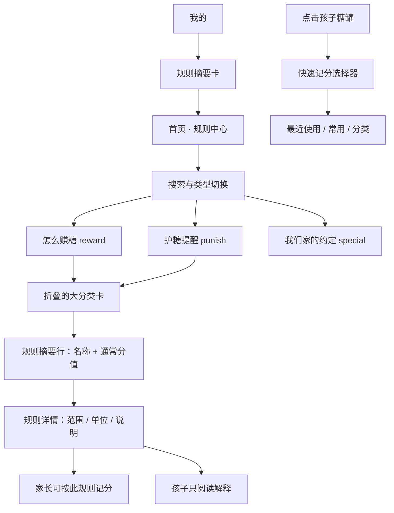

# 糖罐积分｜积分规则界面优化方案

> 归档状态：历史产品/实施方案，不是当前工程真源。文中将家庭规则隔离、稳定规则 ID、revision、规则历史和流水关联列为后续工作的部分，已经在 v2.5 基线中实现；涉及现状时以当前源码、自动化测试和 `docs/plans/` 最新方案为准。
>
> 文档性质：产品与实施方案，仅供后续开发使用
> 项目：糖罐积分微信小程序（AppID：`wx90237ce600b51eea`）
> 审计范围：`hefei-miniapp/pages/index`、`pages/mine`、`pages/admin`、规则选择组件及服务端规则存储
> 本轮约束：只输出方案，不修改业务代码、接口、数据库或现有数据
> 特别说明：本方案只涉及糖罐积分，不涉及 NGL

## 1. 结论先行

推荐采用“一处完整浏览、一处摘要入口、一处快速执行”的规则体系：

- 首页的“规则”页签升级为唯一的完整“规则中心”，负责查找、理解和讲解规则。
- “我的”页面不再完整铺开所有规则，只显示规则摘要、数量和入口。
- 点击孩子糖罐后的记分弹层只服务于快速记分，优先展示常用规则，不再承担完整规则说明书的职责。
- 管理后台改为“分类摘要列表 + 单条编辑面板 + 固定保存栏”，默认只显示最重要的规则名和常用分值；上下限等低频字段收进“高级设置”。
- 第一阶段保持现有 API 路径和 `reward / punish / special` 数据格式不变，主要通过前端派生视图解决密度问题。
- 后续再独立处理规则按家庭隔离、服务端深度校验、规则版本和历史流水关联等数据治理事项。

目标不是删掉必要信息，而是让信息按使用频率逐层出现：

```text
先看懂类型和分类
      ↓
看到规则名称与通常分值
      ↓
需要时再看上下限、单位、说明
      ↓
家长可继续记分，孩子只阅读解释
```

## 2. 审计依据与当前问题

### 2.1 工作目录确认

微信开发者工具较新的 `workspace.json` 指向：

```text
C:\Users\ANGUS\projects\hefei-points\hefei-miniapp
```

与任务指定路径一致。另有一个较早的 `G:\projects\hefei-points` 历史工作区，本方案不以其为依据。

### 2.2 当前规则数据结构

现有结构可以支撑第一阶段界面重构，无需立即迁移数据：

```text
rules
├─ reward[]                         加分大分类
│  └─ category + items[]
│     └─ id / label / min / max / default / unit / hint?
├─ punish[]                         扣分大分类
│  └─ category + items[]
│     └─ id / label / min / max / default / unit / hint?
└─ special[]                        特别规则，目前为纯字符串数组
```

当前持久化方式是 SQLite `rules` 表中的单行 JSON：

```text
rules(id = 1, data_json)
```

### 2.3 当前界面的核心问题

| 位置 | 当前实现 | 主要问题 |
|---|---|---|
| 首页规则页签 | 所有加分分类、扣分分类、小项、范围、单位和特别规则全部展开 | 层级同时出现，页面过长；没有搜索、折叠或快速定位 |
| “我的”规则卡 | 再次完整展示所有加扣分规则 | 与首页重复；不显示特别规则；管理入口被长列表压到底部 |
| 记分弹层 | 第三次展示同一套加扣分树 | 说明和执行混在一起；常用规则没有优先级 |
| 管理后台 | 每个小项同时显示名称、最少、最多、默认、备注五组输入 | 输入控件密集；普通用户难理解字段关系；页面很长 |
| 保存机制 | 整套规则一次性覆盖保存 | 缺少未保存提醒、修改摘要、冲突检测和精确错误定位 |

已核实的具体一致性问题：

- 首页显示 `unit`，“我的”固定写“分”，两处信息不一致。
- “我的”完全遗漏 `special`。
- 首页与“我的”不突出 `default`，但实际快速记分最常用的恰恰是默认分。
- 默认模板带有 `hint`，管理页当前加载和保存时没有保留它；管理员保存一次可能静默丢失全部说明。
- 新增扣分项的编辑默认值存在上下限顺序易倒置的问题，后续重做编辑器时必须一并收敛。
- 规则目前是全局单例，不是按家庭保存；如果产品目标是“每个家庭有自己的规则”，当前存储模型不满足要求。
- 流水只保存 `reason` 文本，报表又使用当前规则名称匹配分类；规则改名后，旧记录可能失去原分类归属。

## 3. 设计目标与原则

### 3.1 可量化目标

1. 打开规则中心时，首屏只出现规则总览、搜索和三种类型，不直接铺满所有小项。
2. 用户查找一条已知规则不超过 3 次操作，目标时间不超过 10 秒。
3. 默认列表中每条规则只突出一个核心数字：通常分值；上下限降为次级信息。
4. “我的”规则摘要卡控制在约一个普通卡片高度，不随规则数量无限增长。
5. 管理员修改一条常用规则时，只需“进入分类 → 点规则 → 改通常分值 → 完成 → 保存整套规则”。
6. 孩子无需理解 `min / max / default` 等系统术语，也能说明“做什么、通常得到或扣掉多少糖”。
7. 第一阶段不改变现有接口路径与请求参数，不影响旧客户端读取规则。

### 3.2 设计原则

- **渐进披露**：先摘要，再展开，再看详情。
- **默认值优先**：先告诉用户通常记多少分，再展示可调范围。
- **阅读与执行分离**：规则中心负责理解，记分弹层负责操作。
- **一个数据源、多种视图**：三处界面共享同一套格式化逻辑，避免再次出现单位、特别规则和主题色不一致。
- **儿童可理解**：技术字段保留在内部，显示文案改成家庭语言。
- **兼容优先**：首轮尽量只做前端派生，不强行升级数据模型。

## 4. 目标信息架构



三处入口的职责必须明确：

| 入口 | 核心任务 | 展示深度 | 是否允许记分 |
|---|---|---|---|
| 首页规则中心 | 查找、理解、给孩子讲规则 | 完整但逐层展开 | 家长可从详情发起；孩子不可 |
| “我的”规则摘要 | 知道规则规模并进入规则中心 | 只显示统计和少量预览 | 否 |
| 糖罐记分弹层 | 尽快找到并执行规则 | 常用与操作信息优先 | 是 |
| 管理后台 | 新增、调整、排序和保存规则 | 编辑态，按分类展开 | 不直接记分 |

## 5. 普通用户端展示方案

### 5.1 首页：从长列表改为“规则中心”

首屏示意：

```text
┌────────────────────────────────┐
│ 我们家的成长约定               │
│ 6 个分类 · 18 条规则 · 3 条约定 │
│ [ 搜索规则、分类或说明……      ] │
│ [全部] [怎么赚糖] [护糖提醒] [家庭约定] │
└────────────────────────────────┘

┌────────────────────────────────┐
│ 常用规则                         │
│ 学校作业              通常 +3  › │
│ 课外阅读              通常 +5  › │
└────────────────────────────────┘

┌────────────────────────────────┐
│ 📚 学习习惯              3 项  › │
│ 学校作业、课外学习、考试成绩…   │
└────────────────────────────────┘

┌────────────────────────────────┐
│ 🏠 家务与自理            4 项  › │
│ 整理房间、收拾书包…             │
└────────────────────────────────┘
```

分类展开后：

```text
📚 学习习惯                         收起⌃
──────────────────────────────────
学校作业                 通常 +3      ›
每科 · 可调 +2～+5
──────────────────────────────────
课外学习                 通常 +10     ›
每次 · 可调 +5～+20
──────────────────────────────────
考试成绩                 通常 +20     ›
每次 · 可调 +0～+50
```

规则详情底部面板：

```text
学校作业

通常得到          +3 分
可调整范围        +2 ～ +5 分
计算方式          每科
为什么这样做      每天检查作业完成情况

给孩子这样解释：
“按时、认真完成自己的作业，就是在为成长糖罐添糖。”

[关闭]                       [按这条规则记分]
```

孩子身份不显示“按这条规则记分”按钮；家长和管理员才显示。

### 5.2 分数信息重新分级

当前每行都突出上下限，视觉上会出现大量重复数字。建议改为：

| 层级 | 展示内容 | 示例 | 出现场景 |
|---|---|---|---|
| 一级 | 通常分值 `default` | `通常 +3` | 分类展开后的列表 |
| 二级 | 可调范围 `min ~ max` | `可调 +2～+5` | 列表辅助行、详情页 |
| 三级 | 单位和说明 `unit / hint` | `每科 · 每天检查作业` | 详情页 |

显示规则：

- `min === max` 时只显示单值，不显示 `+5～+5`。
- 加分使用 `+`；扣分统一使用真正的负号 `−`，避免连字符看起来像范围线。
- 列表分值胶囊固定不换行，长规则名最多两行。
- 规则为空或字段异常时显示“分值待设置”，不拼出 `undefined` 或反向范围。

### 5.3 特别规则统一为“我们家的约定”

第一阶段继续保留 `special: string[]`，只改变展示组织：

```text
🍯 我们家的约定                         3 条
──────────────────────────────────────
01  每月清零和兑换前，先和爸爸妈妈确认
02  连续 7 天全勤，可获得额外奖励
03  生日当天使用双倍积分
```

它是规则中心的第三个分组，不再被塞在所有扣分规则末尾，也不会在“我的”中消失。

### 5.4 “我的”：只保留摘要和入口

建议替换当前完整长列表：

```text
┌────────────────────────────────┐
│ 📋 家庭积分规则              ›  │
│ 6 个分类 · 18 条规则             │
│                                │
│ 赚糖 10 条  护糖 8 条  家庭约定 3 条 │
│                                │
│ [查看全部规则]  [管理规则·管理员] │
└────────────────────────────────┘
```

- 普通家长和孩子看到“查看全部规则”。
- 管理员额外看到“管理规则”。
- 点击“查看全部规则”切换到首页并自动打开规则页签；不复制另一套完整规则 UI。
- 管理后台入口不再被长规则列表压到底部。

## 6. 交互与操作引导

### 6.1 查找一条规则

推荐路径：

```text
首页 → 规则 → 搜索“作业” → 点击结果 → 查看通常分值与完整说明
```

搜索范围包括：

- 大分类名称；
- 小项名称；
- `unit`；
- `hint`；
- 特别规则全文。

结果仍按“怎么赚糖 / 护糖提醒 / 家庭约定”分组。数据量较小，可在前端即时过滤，不需要新增后端接口。

### 6.2 快速理解

- 初次进入时用一行轻提示说明：“通常分值用于一键记录，长按或进入详情可按范围调整。”
- 类型标签同时使用图标、文字和颜色，不只靠红绿区分。
- 每次只默认展开一个分类；切换分类时自动收起前一个，减少页面长度。
- 记住本机上次打开的类型和分类，下次返回原位置；这只是 UI 偏好，不属于业务数据。

### 6.3 常用规则

无需新增“收藏”数据库字段，可基于现有历史流水在本机计算最近 30 天使用次数，展示 3～5 条常用规则：

```text
常用规则
学校作业 +3 ｜课外阅读 +5 ｜做家务 +3
```

若历史记录为空，则显示配置中的前 3 条规则。常用区只是快捷入口，不改变规则本身。

### 6.4 阅读后直接记分

家长在规则详情中点击“按这条规则记分”后：

1. 选择孩子（如果当前没有孩子上下文）；
2. 默认带入 `default`；
3. 展示一次明确确认；
4. 继续走现有积分写入流程。

首轮可不实现此入口，避免把“浏览规则”与“误触记分”同时重做；建议作为第二批交互增强。

## 7. 家长与孩子两种阅读视角

### 7.1 统一底层字段，切换显示语言

| 技术概念 | 家长显示 | 孩子显示 |
|---|---|---|
| reward | 加分规则 / 鼓励加分 | 怎么赚糖 |
| punish | 扣分规则 / 改进提醒 | 护糖提醒 |
| special | 特别规则 | 我们家的约定 |
| default | 通常分值 | 通常会得到/扣掉 |
| min / max | 可调整范围 | 一次大约是 |
| hint | 使用说明 | 为什么这样做 |

仅修改展示文案，API 字段仍保持 `reward / punish / special`。

### 7.2 家长给孩子讲规则的卡片结构

每条详情必须回答四件事：

1. **做什么**：规则名称。
2. **为什么**：一句正向说明，优先使用现有 `hint`。
3. **通常多少**：突出默认分。
4. **什么时候会调整**：范围和单位作为补充。

惩罚类避免大面积危险红和指责性语言。可以保留明确边界，但使用“发生了什么—怎样补救”的表达：

```text
玩手机超时
通常扣 10 分
可以补救：今天按约定时间结束，重新开始连续护糖
```

“补救建议”如需持久化为每条规则独立内容，属于后续数据字段扩展；首轮可用通用文案，不改数据。

## 8. 视觉方案

### 8.1 色彩与语义

| 类型 | 主色 | 浅底色 | 图标语义 | 使用原则 |
|---|---|---|---|---|
| 怎么赚糖 | 薄荷绿 | 淡薄荷 | 星星、上升、糖果 | 表达鼓励和成长 |
| 护糖提醒 | 珊瑚暖橙 | 暖粉米白 | 盾牌、提醒 | 不使用大面积警告红 |
| 家庭约定 | 琥珀黄 | 奶油黄 | 家庭心形、卷轴 | 表达共同承诺 |

- 薄荷主题和琥珀主题均通过现有 CSS 变量驱动，禁止在 WXML 内继续写死 `#639922`、`#E24B4A`。
- 类型必须同时有文字和图标，兼顾色弱用户。
- 图标沿用项目已有统一线性图标系统，不混用散落 emoji；现有分类名里的 emoji 可在视图层放入统一尺寸的图标容器。

### 8.2 层级与卡片

- 页面只有“规则中心主卡”这一层玻璃态容器。
- 分类用白色/浅色面板和分隔线，不再让每个小项都成为独立重阴影卡片。
- 分类卡圆角使用全局 `--radius`，小项和胶囊使用 `--radius-sm`。
- 主要卡片使用柔和外阴影，小项只用分隔线或极浅内底色。
- 分类间距大于规则行间距，用留白表达层级。
- 规则名使用正文级字体，默认分用标签级粗体；仅积分卡大数字使用 `xl`。

### 8.3 无障碍与长文本

- 所有可点击行的最小触控高度建议为 `88rpx`。
- 规则名最多两行；分值胶囊固定宽度、不收缩、不换行。
- `hint` 超过两行时在详情中完整展示，列表只截断。
- 展开状态使用箭头方向和“展开/收起”语义，不只依赖动画。
- 搜索无结果、全空、只有家庭约定等情况分别提供准确空状态。

## 9. 管理后台规则制定简化方案

### 9.1 新的操作架构


后台首屏示意：

```text
积分规则                              搜索
鼓励 10 条 ｜提醒 8 条 ｜约定 3 条

[鼓励加分] [需要改进] [家庭约定]

┌────────────────────────────────┐
│ 📚 学习表现             3 条  ⋯ │
│ 作业按时完成             通常 +3 › │
│ 考试优秀                 通常 +10 ›│
│ 考试进步                  通常 +5 ›│
│ ＋ 添加一条规则                   │
└────────────────────────────────┘

┌────────────────────────────────┐
│ 🏠 家务劳动             3 条  ⋯ │
└────────────────────────────────┘

[＋ 新建分类]

──────────────────────────────────
已修改 3 处              [预览] [保存]
```

### 9.2 单条规则编辑面板

默认只显示普通用户真正需要理解的字段：

```text
编辑鼓励规则

规则名称      [作业按时完成              ]
通常分值      [−]       3       [+]
快速选择      [+1] [+3] [+5] [+10] [+20]
计算方式      [每科                      ]
规则说明      [每天检查作业完成情况       ]

高级设置 ▾
  最低分      [2]
  最高分      [5]

[删除规则]                         [完成]
```

编辑原则：

- `default` 是主字段，`min / max` 放入高级设置。
- 扣分编辑器显示正数绝对值和“扣除”语义；保存适配层继续转换为负数，保持现有 API 兼容。
- 始终校验 `min ≤ default ≤ max`。
- 加分绝对值不得超过现有业务上限 1000，扣分绝对值不得超过 500。
- 字段错误显示在对应输入框下方，不能只弹出笼统的“保存失败”。
- “完成”只更新页面本地草稿，底部“保存”才调用现有整套规则接口。

### 9.3 新建规则流程

```text
＋ 新建规则
   1. 选择“鼓励加分”或“需要改进”
   2. 选择已有分类，或新建分类
   3. 从空白开始，或使用模板
   4. 填规则名和通常分值
   5. 可选填写范围、单位、说明
   6. 完成并加入本地草稿
```

本地模板建议包含：作业、阅读、家务、运动、作息、自理。模板仅用于预填字段，不自动写入数据库。

### 9.4 编辑安全感

- 页面顶部或固定保存栏显示“已修改 N 处”。
- 离开页面前提示“保存、暂存、放弃”。
- 草稿可保存在本机 Storage，并带家庭 ID 和服务端规则版本，避免串家庭恢复。
- 删除小项和家庭约定后提供短时“撤销”，分类整体删除仍需二次确认。
- 保存前展示差异摘要：新增、修改、删除各多少条。
- 保存成功后更新全局规则并重新拉取一次服务端结果，确保页面与持久化一致。

### 9.5 排序、复制与分类操作

- 分类菜单统一放置“重命名、复制分类、排序、删除”。
- 规则行菜单统一放置“复制、移动到分类、排序、删除”。
- 第一阶段可用“上移/下移”保证稳定性；拖拽排序作为后续增强。
- 排序直接保存现有数组顺序，无需改数据库表结构。
- 复制规则必须生成新规则 ID，不能复用原 ID。

## 10. 数据兼容、后端与数据库建议

### 10.1 推荐首轮：保持现有结构

首轮显示和管理重构继续提交：

```json
{
  "reward": [],
  "punish": [],
  "special": []
}
```

好处：

- 不改 `/api/config`、`/api/config/rules` 路径或主体参数。
- 不需要数据库迁移。
- 旧版本小程序仍可读取新版本保存的规则。
- 可以先解决大约 80% 的视觉密度和操作负担。

### 10.2 必须先做的无损适配

管理端不应重新拼装并丢弃未显示字段。建议建立“原始模型 + 编辑草稿 + 序列化器”：

```text
服务端原始规则
  ↓ 深拷贝并保留未知字段
编辑视图模型
  ↓ 只覆盖实际修改字段
兼容序列化
  ↓ 保留 id / hint / unit 及未来扩展字段
原格式提交
```

这样可立即解决 `hint` 静默丢失风险，并为后续字段扩展留出空间。

### 10.3 服务端深度校验

当前服务端只判断 `rules` 是对象。后续至少应验证：

- `reward / punish / special` 类型和最大数量；
- 分类名、规则名、单位、说明长度；
- ID 格式及同一规则集内唯一性；
- 分值必须为有限整数；
- 加分为非负、扣分为负；
- `min ≤ default ≤ max`；
- 特别规则必须为有限长度字符串；
- 无权用户不能保存。

服务端错误应返回字段路径，例如：

```json
{
  "success": false,
  "message": "规则内容有误",
  "field": "punish[1].items[2].default"
}
```

### 10.4 规则按家庭隔离：需要产品确认的决策门

当前 `rules` 表固定 `id = 1`，所有家庭共享一套规则。若产品语义是“每个家庭自行制定规则”，则在正式开放多家庭管理前应改为：

```text
rules
├─ family_id  PRIMARY KEY / FOREIGN KEY
├─ revision
├─ data_json
├─ updated_by
└─ updated_at
```

迁移策略：

1. 备份现有数据库。
2. 建立新表或新结构。
3. 将旧 `id = 1` 的规则复制给现有每个家庭，或只作为默认模板；该选择必须由产品确认。
4. `/api/config` 按当前 Token 的 `familyId` 返回规则。
5. `/api/config/rules` 只更新管理员自己的家庭。
6. 回归验证两个家庭之间互不影响。

这不是首轮 UI 重构的前置条件，但属于多家庭环境下必须独立立项的数据隔离工作。

### 10.5 规则改名与历史流水

当前流水只保存 `reason` 文本。短期措施：

- 管理员改名时提示“旧流水仍保留旧名称，历史报表分类可能受影响”。
- 允许保留旧名称别名，仅在前端报表匹配时兼容。

长期根治：

- 为分类和规则提供稳定 ID；
- 流水增加 `rule_id / category_id`，同时继续保存 `reason` 快照；
- 报表优先按 ID 聚合，旧流水再按文本兜底。

长期方案需要前端、后端和数据库共同改造，不应与首轮纯 UI 重构混在一个发布版本中。

## 11. 优化项范围、工作量与风险总表

工作量口径：

- **小**：约 0.5～1 人日，局部改动。
- **中**：约 2～4 人日，涉及新组件或多页面联动。
- **大**：5 人日以上，涉及接口、迁移或跨模块回归。

风险口径：

- **低**：纯展示或本地交互，可快速回退。
- **中**：影响编辑、保存、数据兼容或多个现有入口。
- **高**：涉及跨家庭隔离、数据库迁移或历史数据语义。

| ID | 优化点 | 改动范围 | 工作量 | 风险 | 建议阶段 |
|---|---|---|---|---|---|
| D-01 | 建立唯一完整规则中心，三处入口明确分工 | 前端；后端无；数据库无 | 中 | 低 | 第一阶段 |
| D-02 | 类型切换、分类折叠、渐进披露 | 前端；后端无；数据库无 | 中 | 低 | 第一阶段 |
| D-03 | 默认分优先，范围/单位/说明降级到详情 | 前端；后端无；数据库无 | 小 | 低 | 第一阶段 |
| D-04 | `special[]` 统一收纳为“我们家的约定” | 前端；后端无；数据库无 | 小 | 低 | 第一阶段 |
| D-05 | “我的”改为规则摘要卡，管理员入口上移 | 前端；后端无；数据库无 | 小 | 低 | 第一阶段 |
| I-01 | 本地搜索、类型筛选和匹配结果分组 | 前端；后端无；数据库无 | 小 | 低 | 第一阶段 |
| I-02 | 基于现有流水计算最近常用规则 | 前端；复用现有接口；数据库无 | 中 | 低 | 第一阶段 |
| I-03 | 规则详情底部面板 | 前端；后端无；数据库无 | 中 | 低 | 第一阶段 |
| I-04 | 家长从规则详情发起记分 | 前端；复用现有接口；数据库无 | 中 | 中 | 第二阶段 |
| I-05 | 记住上次类型/分类，支持“我的”直达规则页签 | 前端；后端无；数据库无 | 小 | 低 | 第一阶段 |
| U-01 | 家长/孩子角色化文案和操作权限 | 前端；后端无；数据库无 | 小 | 低 | 第一阶段 |
| U-02 | 长文本、触控尺寸、色弱与空状态适配 | 前端；后端无；数据库无 | 小 | 低 | 第一阶段 |
| V-01 | 糖果暖色视觉系统、主题 token、统一图标和卡片层级 | 前端；后端无；数据库无 | 中 | 低 | 第一阶段 |
| A-01 | 后台分类摘要化、默认折叠、固定保存栏 | 前端；后端无；数据库无 | 中 | 中 | 第一阶段 |
| A-02 | 单条编辑面板，通常分值优先，高级范围折叠 | 前端；后端无；数据库无 | 中 | 中 | 第一阶段 |
| A-03 | 快捷分值、模板、复制、移动和排序 | 前端；后端无；数据库无 | 中 | 低 | 第二阶段 |
| A-04 | 本地草稿、离开提醒、差异预览、删除撤销 | 前端；后端无；数据库无 | 中 | 中 | 第二阶段 |
| G-01 | 无损规则适配，保留 `hint` 和未知字段 | 前端；API 格式不变；数据库无 | 小 | 中 | 第一阶段/P0 |
| G-02 | 修复扣分编辑上下限语义并做完整客户端校验 | 前端；后端无；数据库无 | 小 | 中 | 第一阶段/P0 |
| G-03 | 服务端规则结构、长度、数值和 ID 校验 | 后端；前端处理字段错误；数据库无 | 中 | 中 | 第二阶段 |
| G-04 | 增加 `revision`，防止多管理员整套覆盖 | 后端；前端携带版本；数据库可无迁移或小迁移 | 中 | 中 | 第二阶段 |
| G-05 | 分类稳定 ID、规则改名提醒和旧名称兼容 | 前端、后端；数据库首轮可无 | 中 | 中 | 第二阶段 |
| G-06 | 规则按 `family_id` 隔离 | 前端、后端、数据库 | 大 | 高 | 第三阶段/独立立项 |
| G-07 | 流水保存 `rule_id / category_id`，报表按 ID 聚合 | 前端、后端、数据库 | 大 | 高 | 第三阶段/独立立项 |
| G-08 | 规则版本历史与一键恢复 | 后端、数据库；前端增加历史页 | 大 | 中 | 第三阶段 |

## 12. 后续实施时的文件改动地图

以下仅用于指导后续开发，本轮不修改这些文件。

### 12.1 第一阶段：前端规则中心

建议新增：

```text
hefei-miniapp/
├─ utils/rules-view-model.js
├─ components/rule-browser/
├─ components/rule-category/
└─ components/rule-detail-sheet/
```

建议修改：

| 文件 | 后续改造内容 |
|---|---|
| `pages/index/index.js` | 构建筛选、搜索、展开状态、常用规则和角色化文案 |
| `pages/index/index.wxml` | 用规则中心替换当前完整平铺列表 |
| `pages/index/index.wxss` | 使用主题 token、折叠卡、分值胶囊和长文本保护 |
| `pages/index/index.json` | 注册规则浏览和详情组件 |
| `pages/mine/mine.js` | 计算分类/规则/约定数量，处理直达规则中心 |
| `pages/mine/mine.wxml` | 把完整规则列表替换成摘要卡 |
| `pages/mine/mine.wxss` | 新增摘要卡与管理员快捷入口样式 |
| `components/action-sheet/*` | 第二批复用规则视图模型，增加常用规则但保留现有记分事件 |

### 12.2 第一、二阶段：管理后台

| 文件 | 后续改造内容 |
|---|---|
| `pages/admin/admin.js` | 无损草稿、校验、差异计算、分类展开、编辑面板、排序和保存状态 |
| `pages/admin/admin.wxml` | 摘要列表、单条编辑面板、固定保存栏 |
| `pages/admin/admin.wxss` | 减少密集输入框，增加表单分组和错误态 |
| `pages/admin/admin.json` | 注册编辑面板、确认/撤销组件 |
| `utils/rules-view-model.js` | 浏览端和管理端共用格式化、分值显示和兼容序列化 |

### 12.3 第二阶段：后端保护

| 文件 | 后续改造内容 |
|---|---|
| `server/routes/config.js` | 在保存规则前执行深度校验；支持 revision 冲突响应 |
| `server/lib/validation.js` | 增加规则树、字段长度、ID、分值关系校验 |
| `server/db/repositories/config.js` | 条件更新 revision；返回修改时间和修改人 |

### 12.4 第三阶段：家庭隔离与历史关联

| 文件 | 后续改造内容 |
|---|---|
| `server/db/migrations/00x_family_rules.sql` | 规则表按 `family_id` 存储并迁移旧数据 |
| `server/db/repositories/config.js` | 所有读写显式接收 `familyId` |
| `server/routes/config.js` | 只返回和更新当前 Token 家庭规则 |
| `server/db/migrations/00x_transaction_rule_ids.sql` | 流水增加稳定规则/分类 ID |
| `server/db/repositories/transactions.js` | 写入规则 ID，同时保留 reason 快照 |
| `pages/report/report.js` | 报表优先按规则 ID 聚合，旧记录按名称兜底 |

## 13. 推荐实施顺序与里程碑

### 里程碑 A：纯前端减负版

包含：D-01～D-05、I-01、I-03、I-05、U-01、U-02、V-01、A-01、A-02、G-01、G-02。

交付结果：

- 首页不再一次性铺满所有规则。
- “我的”不再重复完整列表。
- 默认分、范围和说明层级清楚。
- 管理后台可以单条编辑，不再同时面对大量输入框。
- 不改接口、不迁移数据库。

### 里程碑 B：效率与数据保护版

包含：I-02、I-04、A-03、A-04、G-03～G-05。

交付结果：

- 常用规则和规则内直接记分形成闭环。
- 管理员拥有模板、复制、排序、草稿、撤销和修改预览。
- 服务端拒绝畸形规则，并能提示并发覆盖。

### 里程碑 C：多家庭数据治理版

包含：G-06～G-08。

交付结果：

- 每个家庭独立拥有规则。
- 规则改名不再破坏历史报表归类。
- 规则可追溯、可恢复。

该里程碑需要单独的数据迁移方案、备份、灰度和回滚预案，不应与 UI 版本一次上线。

## 14. 后续开发验收清单

### 14.1 普通用户端

- [ ] 首页规则中心首屏不完整展开所有规则。
- [ ] 可在 3 次操作内找到指定规则。
- [ ] 搜索覆盖分类、规则名、单位、说明和家庭约定。
- [ ] 列表突出通常分值，范围与说明为次级信息。
- [ ] 固定分值不显示成重复范围。
- [ ] 家庭约定在首页完整可见，在“我的”摘要计数准确。
- [ ] “我的”规则区保持紧凑，并能直达规则中心。
- [ ] 家长和管理员可操作，孩子身份没有记分按钮。
- [ ] 薄荷绿与琥珀主题均无写死颜色导致的割裂。
- [ ] 长名称、长单位、长说明均不挤压分值或溢出卡片。
- [ ] 空规则、只有加分、只有扣分、只有家庭约定均有正确空状态。

### 14.2 管理后台

- [ ] 默认只展开当前编辑分类，其余分类为摘要。
- [ ] 修改一条规则不需要同时面对其他规则的输入框。
- [ ] 通常分值、最低分、最高分关系有即时校验。
- [ ] 扣分界面输入绝对值，持久化结果仍为负数且上下限顺序正确。
- [ ] 编辑和保存不会丢失 `hint` 或其他未知字段。
- [ ] 删除小项可撤销，删除分类有明确确认。
- [ ] 离开未保存页面会提醒。
- [ ] 保存前能看到新增、修改、删除摘要。
- [ ] 保存失败时草稿不丢失，并定位具体错误字段。
- [ ] 两个管理员同时编辑时能提示版本冲突，而不是静默覆盖。

### 14.3 数据兼容与回归

- [ ] 现有 `reward / punish / special` 数据无需人工修改即可显示。
- [ ] 旧客户端读取第一、二阶段保存的数据不崩溃。
- [ ] 首页快捷加减分、长按调分和手动输入不回归。
- [ ] 规则 ID、名称、默认值、范围和单位保存前后保持一致。
- [ ] 历史流水与成长报表在规则未改名时结果完全一致。
- [ ] 若实施家庭隔离，家庭 A 修改规则后家庭 B 完全不受影响。

## 15. 最终建议

最值得先做的不是继续给现有长列表“换皮”，而是先改变三处入口的职责和信息层级。推荐第一版严格控制在前端规则中心、摘要卡、单条编辑器和无损保存适配四件事上；它们不要求迁移数据库，却能直接解决密密麻麻、难查找、难讲解和难编辑的问题。

规则按家庭隔离、流水关联稳定规则 ID 等问题价值很高，但风险也高，应在 UI 改造稳定后单独立项。这样既能快速改善家庭日常使用，又不会把一次界面优化扩大成不可控的数据迁移。
